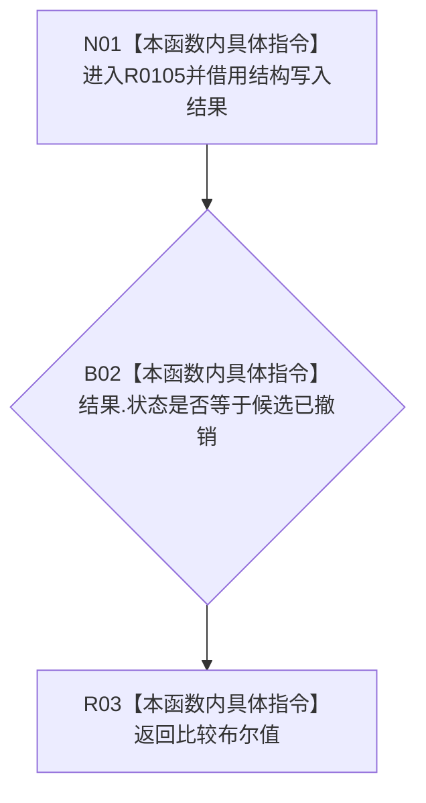

# CF-L9-0011 结构写入执行器撤销完成现状流程图

图类型：现状流程图
代码版本：`7ad8cf5113162fe92b9f8d43f2b5b9f00d292d1a`
源码事实提交：`3920a74638264f9f539d50f32f3c9fe5fb1982ab`
源码 blob：`292e602cef1dd658ac2b507a3cc9ced7270a4a86`
覆盖文件：`海中鱼巣/核心/执行器.结构写入.ixx:362-364`
唯一根函数：R0105
完整签名：`static bool 海中鱼巣::结构写入执行器::撤销完成(const 海中鱼巣::结构写入结果& 结果) noexcept`
参数：`结果` 为 const 非拥有借用
返回结果：状态等于 `候选已撤销` 时返回 true，否则返回 false
已登记调用方：R0102/R0108/R0116，经 RCE0530/RCE0543/RCE0565
直接项目函数：无
外部边界：无
未解析项目调用：0
逐行映射表：`流程图/代码流程图/L9/CF-L9-0011_结构写入执行器撤销完成_逐行代码映射表.md`
结构读取与写入：只读结果状态，零结构变化
验证输出：362—364 行完整映射；3 条项目入边、0 条项目出边、0 个外部边界
不得作为施工许可：是

## 流程图

## 当前边界

- 本函数仅比较枚举状态，不调用项目函数或外部函数。
- true 只表示传入结果的状态枚举为 `候选已撤销`，不独立证明所有参与者均已撤销。
