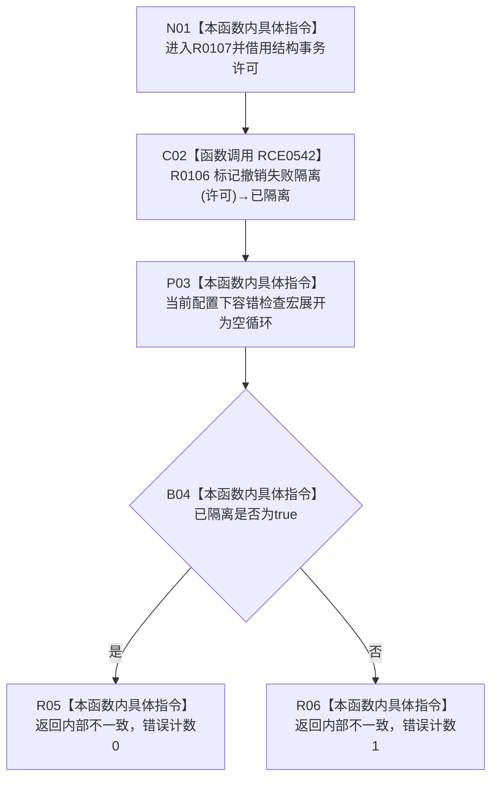

# CF-L9-0012 结构写入执行器隔离后内部不一致现状流程图

图类型：现状流程图
代码版本：`7ad8cf5113162fe92b9f8d43f2b5b9f00d292d1a`
源码事实提交：`3920a74638264f9f539d50f32f3c9fe5fb1982ab`
源码 blob：`292e602cef1dd658ac2b507a3cc9ced7270a4a86`
覆盖文件：`海中鱼巣/核心/执行器.结构写入.ixx:371-375`
唯一根函数：R0107
完整签名：`海中鱼巣::结构写入结果 海中鱼巣::结构写入执行器::隔离后内部不一致(const 海中鱼巣::结构事务许可& 许可) const noexcept`
参数：`许可` 为 const 非拥有借用
返回结果：总是返回 `内部不一致`；隔离成功时内部错误计数为0，否则为1
已登记调用方：R0102/R0108/R0116，经 RCE0531/RCE0544/RCE0566
直接项目函数：RCE0542→R0106
外部边界：无
配置边界：Debug|x64 未定义 `HY_EGO_ENABLE_FAULT_TOLERANCE_CHECK`，第373行容错宏展开为空 `do{}while(false)`
未解析项目调用：0
逐行映射表：`流程图/代码流程图/L9/CF-L9-0012_结构写入执行器隔离后内部不一致_逐行代码映射表.md`
结构读取与写入：实际隔离写入由 R0106 后继完成；本函数形成值式错误结果
验证输出：371—375 行完整映射；3 条项目入边、1 条项目出边、0 个外部边界
不得作为施工许可：是

## 流程图

## 当前边界

- 当前 Debug|x64 基线下第373行不调用 `记录容错检查错误`，因此不新增项目边或外部边界。
- 返回状态固定为 `内部不一致`；最后一个计数字段只反映隔离标记是否成功。
