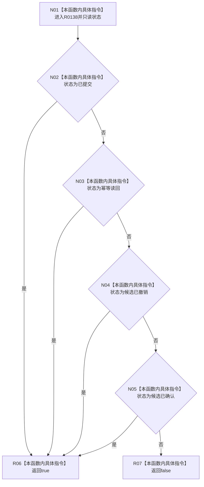

# CF-L9-0013 结构写入结果成功现状流程图

图类型：现状流程图
代码版本：`73cc1af758e041519fa27c1dd57b9d5d07e3405a`
源码 blob：`f54942715c7fce9a678f47fe595ec2080e04427d`
覆盖文件：`海中鱼巣/核心/结果.结构写入.h:26-31`
唯一根函数：R0138
完整签名：`bool 海中鱼巣::结构写入结果::成功() const noexcept`
参数：无显式参数；只读 `this` 指向的结构写入结果
返回结果：状态为已提交、幂等读回、候选已撤销或候选已确认时返回 `true`，否则返回 `false`
已登记调用方：RCE0314、RCE0408、RCE0414、RCE0571、RCE0615、RCE1829、RCE1845、RCE1846、RCE1847、RCE2153、RCE2154、RCE2155、RCE2430、RCE2431、RCE2433、RCE2448、RCE2484、RCE2519、RCE2523
直接项目函数：无
外部边界：无；未解析项目调用：0
调用图：`流程图/主程序可达调用关系/01_main可达项目调用边表.md`
逐行映射表：`流程图/代码流程图/L9/CF-L9-0013_结构写入结果成功_逐行代码映射表.md`
偏差清单：无
依据提交 / 结构化消息：当前源码与上述 19 条稳定项目入边
结构读取与写入：只读结果状态；不读取版本 / 编号，不写结构
逻辑内返回：状态不属于四个成功状态时返回 `false`
生命周期与资源释放：不取得资源
异常：函数声明 `noexcept`
验证输出：26—31 行完整映射；19 条项目入边、0 条项目出边、0 个外部边界
不得作为施工许可：是
不得宣称：返回 `true` 一律表示产生了新结构变化

## 流程图

## 当前边界

- 四个状态均被本函数归入“成功”，但只有调用方结合具体状态才能判断是否改变结构。
- 结构编号、请求版本和当前版本不参与本函数判断。
