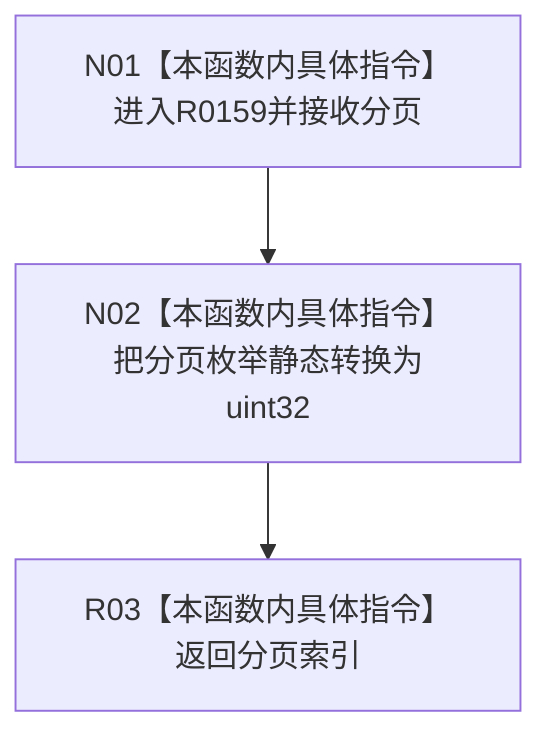

# CF-L9-0014 分页索引现状流程图

图类型：现状流程图
代码版本：`3920a74638264f9f539d50f32f3c9fe5fb1982ab`
源码 blob：`fe9dad1eb3728c823beccf305c783be96a3df33d`
覆盖文件：`海中鱼巣/界面/控制面板窗口.cpp:137-139`
唯一根函数：R0159
完整签名：`std::uint32_t 海中鱼巣::{匿名命名空间@控制面板窗口.cpp}::分页索引(控制面板分页 分页)`
参数：`分页` 按值传入
返回结果：返回分页枚举转换后的 32 位无符号索引
已登记调用方：RCE0719（R0199）、RCE0728（R0200）
直接项目函数：无
外部边界：无；未解析项目调用：0
调用图：`流程图/主程序可达调用关系/01_main可达项目调用边表.md`
逐行映射表：`流程图/代码流程图/L9/CF-L9-0014_分页索引_逐行代码映射表.md`
偏差清单：无
依据提交 / 结构化消息：当前源码、RCE0719、RCE0728
结构读取与写入：纯计算
逻辑内返回：不适用
生命周期与资源释放：不取得资源
异常：未声明 `noexcept`
验证输出：137—139 行完整映射；2 条项目入边、0 条项目出边、0 个外部边界
不得作为施工许可：是
不得宣称：索引转换证明分页已切换或界面已更新

## 流程图

## 当前边界

- 本函数不检查枚举值范围，只执行底层数值转换。
