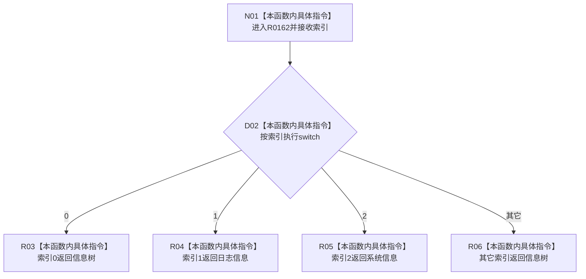

# CF-L9-0015 从分页索引读取分页现状流程图

图类型：现状流程图
代码版本：`3920a74638264f9f539d50f32f3c9fe5fb1982ab`
源码 blob：`fe9dad1eb3728c823beccf305c783be96a3df33d`
覆盖文件：`海中鱼巣/界面/控制面板窗口.cpp:141-152`
唯一根函数：R0162
完整签名：`控制面板分页 海中鱼巣::{匿名命名空间@控制面板窗口.cpp}::从分页索引读取分页(std::uint32_t 索引)`
参数：`索引` 按值传入
返回结果：0、1、2 分别映射到信息树、日志信息、系统信息；其它值兜底返回信息树
已登记调用方：RCE0729（R0200，`控制面板窗口.cpp:933`）
直接项目函数：无
外部边界：无；未解析项目调用：0
调用图：`流程图/主程序可达调用关系/01_main可达项目调用边表.md`
逐行映射表：`流程图/代码流程图/L9/CF-L9-0015_从分页索引读取分页_逐行代码映射表.md`
偏差清单：无
依据提交 / 结构化消息：当前源码、RCE0729
结构读取与写入：纯判断，不修改结构
逻辑内返回：未知索引兜底为信息树
生命周期与资源释放：不取得资源
异常：未声明 `noexcept`
验证输出：141—152 行完整映射；1 条项目入边、0 条项目出边、0 个外部边界
不得作为施工许可：是
不得宣称：索引映射证明分页切换已经成功

## 流程图

## 当前边界

- 未知索引静默回退到信息树，不返回错误。
