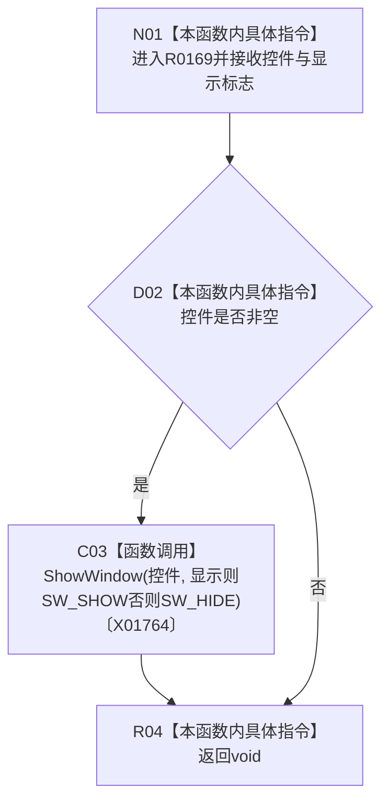

# CF-L9-0016 显示控件现状流程图

图类型：现状流程图
代码版本：`3920a74638264f9f539d50f32f3c9fe5fb1982ab`
源码 blob：`fe9dad1eb3728c823beccf305c783be96a3df33d`
覆盖文件：`海中鱼巣/界面/控制面板窗口.cpp:166-170`
唯一根函数：R0169
完整签名：`void 海中鱼巣::{匿名命名空间@控制面板窗口.cpp}::显示控件(HWND 控件, bool 显示)`
参数：控件句柄和值布尔标志均按值传入；控件不转移所有权
返回结果：`void`
已登记调用方：RCE0709（R0195，`控制面板窗口.cpp:772-782`）
直接项目函数：无
外部边界：X01764（ShowWindow）；未解析项目调用：0
调用图：`流程图/主程序可达调用关系/01_main可达项目调用边表.md`
逐行映射表：`流程图/代码流程图/L9/CF-L9-0016_显示控件_逐行代码映射表.md`
偏差清单：无
依据提交 / 结构化消息：当前源码、RCE0709、X01764
结构读取与写入：只改变非空 Win32 控件的可见状态，不写项目机器事实
逻辑内返回：空控件句柄时不调用系统边界并正常返回
生命周期与资源释放：不取得或销毁控件
异常：未声明 `noexcept`
验证输出：166—170 行完整映射；1 条项目入边、0 条项目出边、1 个外部边界
不得作为施工许可：是
不得宣称：控件可见性变化证明对应业务材料存在或有效

## 流程图

## 当前边界

- 空句柄被静默忽略。
- 系统调用结果没有被接收或判断。
