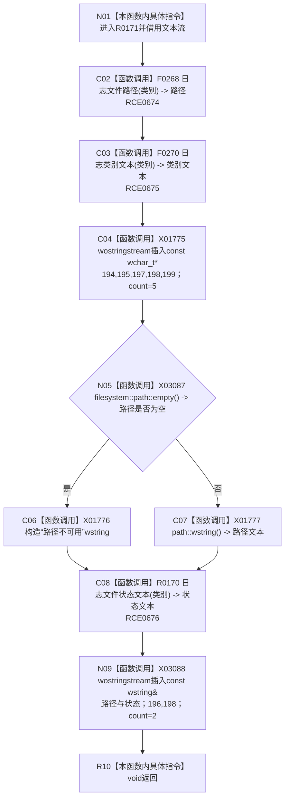

# CF-L9-0017 追加日志文件行现状流程图

图类型：现状流程图
代码版本：`3920a74638264f9f539d50f32f3c9fe5fb1982ab`
源码 blob：`fe9dad1eb3728c823beccf305c783be96a3df33d`
覆盖文件：`海中鱼巣/界面/控制面板窗口.cpp:192-200`
唯一根函数：R0171
完整签名：`void 海中鱼巣::{匿名命名空间@控制面板窗口.cpp}::追加日志文件行(std::wostringstream& 文本, 日志类别 类别)`
参数：`文本` 为可写借用流；`类别` 按值传入
返回结果：`void`；向文本流追加类别、路径和状态两行
已登记调用方：RCE0713（R0197，873/875/877）
直接项目函数：RCE0674 → F0268；RCE0675 → F0270；RCE0676 → R0170
被调函数流程图：`流程图/代码流程图/L10/CF-L10-0027_日志文件状态文本_现状流程图.md`
外部边界：X01775—X01777、X03087、X03088；未解析项目调用：0
逐行映射表：`流程图/代码流程图/L9/CF-L9-0017_追加日志文件行_逐行代码映射表.md`
依据：关系发布基线 `010784a906e8283644a63a742151f6457a847c38` 与冻结源码
结构读写：只改人读文本流，不写项目机器结构
不得作为施工许可：是
不得宣称：追加文本证明对应日志文件存在或内容已验证

## 流程图

## 当前边界

- 193 行只保留项目边 RCE0674，不再保留重复的外部边界反查。
- 文本流写入属于人读材料；函数不创建日志文件。
