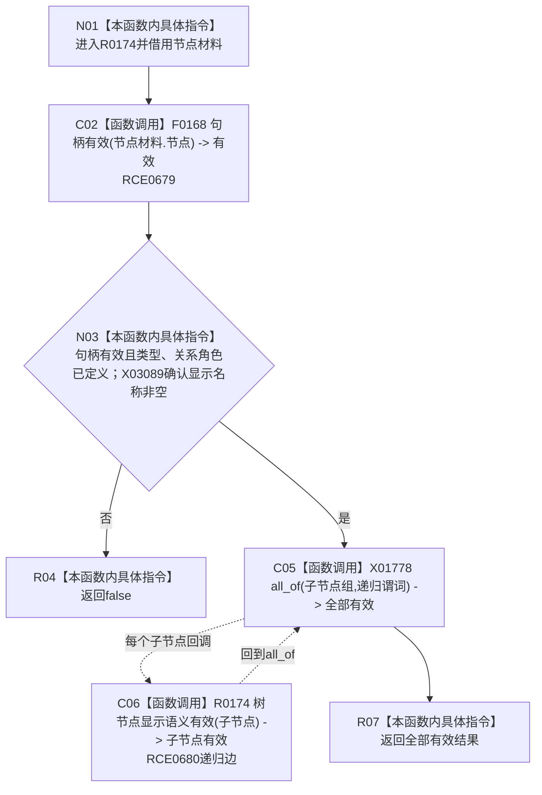

# CF-L9-0019 树节点显示语义有效现状流程图

图类型：现状流程图
代码版本：`3920a74638264f9f539d50f32f3c9fe5fb1982ab`
源码 blob：`fe9dad1eb3728c823beccf305c783be96a3df33d`
覆盖文件：`海中鱼巣/界面/控制面板窗口.cpp:218-231`
唯一根函数：R0174
完整签名：`bool 海中鱼巣::{匿名命名空间@控制面板窗口.cpp}::树节点显示语义有效(const 海中鱼巣::控制面板树节点材料& 节点材料)`
参数：`节点材料` 为只读借用
返回结果：当前节点基础字段和全部递归子节点均有效时返回 `true`
已登记调用方：RCE0680（递归自调用）、RCE0682（R0175）
直接项目函数：RCE0679 → F0168 `句柄有效`；RCE0680 → R0174（递归）
外部边界：X01778 `std::all_of`、X03089 `std::wstring::empty`；未解析项目调用：0
逐行映射表：`流程图/代码流程图/L9/CF-L9-0019_树节点显示语义有效_逐行代码映射表.md`
依据：关系发布基线 `010784a906e8283644a63a742151f6457a847c38` 与冻结源码
结构读写：只读节点材料，不写结构
不得作为施工许可：是
不得宣称：显示语义有效证明节点已持久化或关系真实

## 流程图

## 当前边界

- 当前节点基础检查失败时不遍历子节点。
- X01778 的谓词通过 RCE0680 递归调用同一函数；空子节点组按 `all_of` 语义返回真。
