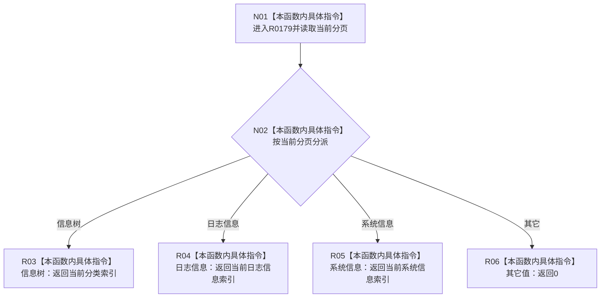

# CF-L9-0021 当前导航索引现状流程图

图类型：现状流程图
代码版本：`3920a74638264f9f539d50f32f3c9fe5fb1982ab`
源码 blob：`fe9dad1eb3728c823beccf305c783be96a3df33d`
覆盖文件：`海中鱼巣/界面/控制面板窗口.cpp:527-537`
唯一根函数：R0179
完整签名：`std::uint32_t 海中鱼巣::控制面板窗口::窗口实现::当前导航索引() const`
参数：无显式参数；只读当前分页及三个索引字段
返回结果：返回当前分页对应索引；未知分页返回零
已登记调用方：RCE0693（R0183，572）
直接项目函数：无；外部边界：无；未解析项目调用：0
逐行映射表：`流程图/代码流程图/L9/CF-L9-0021_当前导航索引_逐行代码映射表.md`
依据：关系发布基线 `010784a906e8283644a63a742151f6457a847c38` 与冻结源码
结构读写：只读窗口导航状态
不得作为施工许可：是
不得宣称：返回索引已经在导航控件中选中

## 流程图

## 当前边界

- 本函数不检查返回索引是否小于当前导航项数量。
- 越界检查由调用方 R0183 完成。
