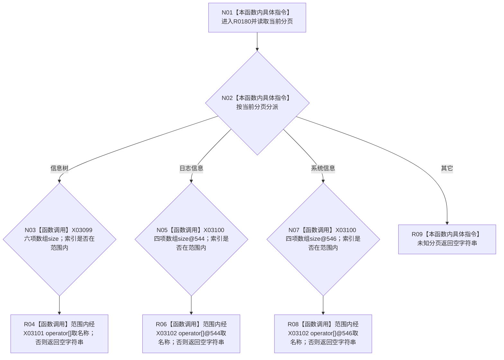

# CF-L9-0022 当前导航名称现状流程图

图类型：现状流程图
代码版本：`3920a74638264f9f539d50f32f3c9fe5fb1982ab`
源码 blob：`fe9dad1eb3728c823beccf305c783be96a3df33d`
覆盖文件：`海中鱼巣/界面/控制面板窗口.cpp:539-549`
唯一根函数：R0180
完整签名：`const wchar_t* 海中鱼巣::控制面板窗口::窗口实现::当前导航名称(std::uint32_t 索引) const`
参数：`索引` 按值传入
返回结果：分页和索引有效时返回静态名称指针，否则返回空宽字符串指针
已登记调用方：RCE0692（R0183，567）
直接项目函数：无；外部边界：X03099—X03102；未解析项目调用：0
逐行映射表：`流程图/代码流程图/L9/CF-L9-0022_当前导航名称_逐行代码映射表.md`
依据：关系发布基线 `010784a906e8283644a63a742151f6457a847c38` 与冻结源码
结构读写：只读当前分页和三个静态名称数组
不得作为施工许可：是
不得宣称：返回非空名称证明导航控件含有该项

## 流程图

## 当前边界

- 返回值均指向静态名称数组元素或宽字符串字面量，不转移所有权。
- 三个分页分支的数组 `size` 与范围内 `operator[]` 已分别绑定 X03099—X03102。
