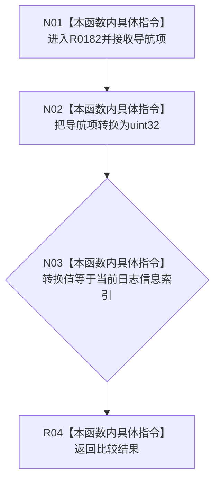

# CF-L9-0023 当前日志信息是现状流程图

图类型：现状流程图
代码版本：`3920a74638264f9f539d50f32f3c9fe5fb1982ab`
源码 blob：`fe9dad1eb3728c823beccf305c783be96a3df33d`
覆盖文件：`海中鱼巣/界面/控制面板窗口.cpp:555-557`
唯一根函数：R0182
完整签名：`bool 海中鱼巣::控制面板窗口::窗口实现::当前日志信息是(海中鱼巣::日志信息导航 导航项) const`
参数：`导航项` 按值传入
返回结果：枚举转换后的索引等于当前日志信息索引时返回 `true`
已登记调用方：RCE0712（R0197，872/874/876）
直接项目函数：无；外部边界：无；未解析项目调用：0
逐行映射表：`流程图/代码流程图/L9/CF-L9-0023_当前日志信息是_逐行代码映射表.md`
依据：关系发布基线 `010784a906e8283644a63a742151f6457a847c38` 与冻结源码
结构读写：只读当前日志信息索引
不得作为施工许可：是
不得宣称：匹配结果证明对应日志文件存在

## 流程图

## 当前边界

- 函数不读取日志材料，仅比较导航状态。
