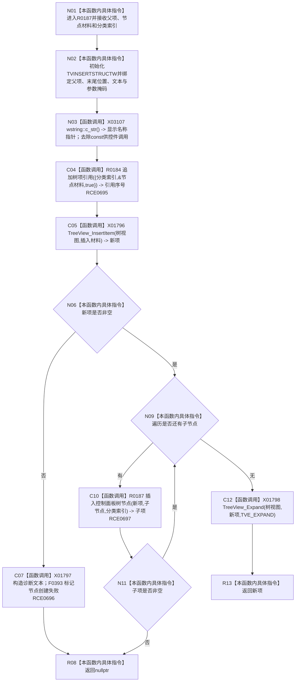

# CF-L9-0024 插入控制面板树节点现状流程图

图类型：现状流程图
代码版本：`3920a74638264f9f539d50f32f3c9fe5fb1982ab`
源码 blob：`fe9dad1eb3728c823beccf305c783be96a3df33d`
覆盖文件：`海中鱼巣/界面/控制面板窗口.cpp:601-620`
唯一根函数：R0187
完整签名：`HTREEITEM 海中鱼巣::控制面板窗口::窗口实现::插入控制面板树节点(HTREEITEM 父项, const 海中鱼巣::控制面板树节点材料& 节点材料, std::uint32_t 分类索引)`
参数：父树项句柄按值；节点材料只读借用；分类索引按值
返回结果：当前节点及全部后代插入成功时返回新树项句柄，否则返回 `nullptr`
已登记调用方：RCE0697（递归）、RCE0703（R0189）
直接项目函数：RCE0695 → R0184；RCE0696 → F0393；RCE0697 → R0187（递归）
外部边界：X01796—X01798、X03107；未解析项目调用：0
逐行映射表：`流程图/代码流程图/L9/CF-L9-0024_插入控制面板树节点_逐行代码映射表.md`
依据：关系发布基线 `010784a906e8283644a63a742151f6457a847c38` 与冻结源码
结构读写：追加引用、插入并展开 Windows 树项；失败时已插入的前序树项 / 引用不在本函数回滚
不得作为施工许可：是
不得宣称：返回树项句柄证明节点材料已写入项目仓库

## 流程图

## 当前边界

- 递归失败直接返回空指针，不删除此前已插入的当前节点或兄弟节点。
- 606 行 `wstring::c_str()` 已绑定 X03107。
