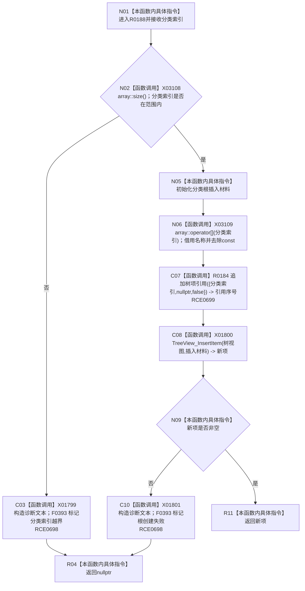

# CF-L9-0025 插入分类树根现状流程图

图类型：现状流程图
代码版本：`3920a74638264f9f539d50f32f3c9fe5fb1982ab`
源码 blob：`fe9dad1eb3728c823beccf305c783be96a3df33d`
覆盖文件：`海中鱼巣/界面/控制面板窗口.cpp:622-639`
唯一根函数：R0188
完整签名：`HTREEITEM 海中鱼巣::控制面板窗口::窗口实现::插入分类树根(std::uint32_t 分类索引)`
参数：`分类索引` 按值传入
返回结果：分类有效且根项插入成功时返回树项句柄，否则返回 `nullptr`
已登记调用方：RCE0701（R0189，659）
直接项目函数：RCE0698 → F0393；RCE0699 → R0184
外部边界：X01799—X01801、X03108、X03109；未解析项目调用：0
逐行映射表：`流程图/代码流程图/L9/CF-L9-0025_插入分类树根_逐行代码映射表.md`
依据：关系发布基线 `010784a906e8283644a63a742151f6457a847c38` 与冻结源码
结构读写：追加分类根引用并插入 Windows 树根项
不得作为施工许可：是
不得宣称：分类根插入成功证明真实根节点已经插入

## 流程图

## 当前边界

- 分类根引用的 `节点材料` 为 `nullptr`，`是结构节点` 为假。
- 623 行 `size` 与 631 行 `operator[]` 已分别绑定 X03108、X03109。
