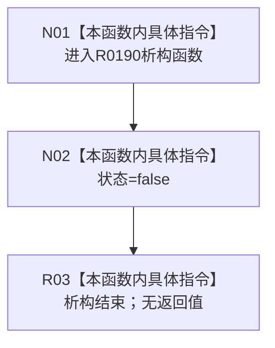

# CF-L9-0026 重建状态收口器析构现状流程图

图类型：现状流程图
代码版本：`3920a74638264f9f539d50f32f3c9fe5fb1982ab`
源码 blob：`fe9dad1eb3728c823beccf305c783be96a3df33d`
覆盖文件：`海中鱼巣/界面/控制面板窗口.cpp:648-650`
唯一根函数：R0190
完整签名：`海中鱼巣::控制面板窗口::窗口实现::重建当前树视图()::重建状态收口器::~重建状态收口器() noexcept`
参数：无显式参数；借用成员引用 `bool& 状态`
返回结果：析构函数无返回值；离开作用域时把所引用状态写为 `false`
已登记调用方：RCE0702
直接项目函数：无
外部边界：无；未解析项目调用：0
逐行映射表：`流程图/代码流程图/L9/CF-L9-0026_重建状态收口器析构_逐行代码映射表.md`
依据：关系发布基线 `010784a906e8283644a63a742151f6457a847c38` 与冻结源码
结构读写：只写调用方提供的重建状态标志，不写节点、关系或索引
不得作为施工许可：是
不得宣称：析构收口证明树视图重建成功

## 流程图

## 当前边界

- RCE0702 由 R0189 在局部收口器已构造后的六个作用域退出点触发。
- 本函数只负责重建标志收口，不读取或裁决界面重建结果。
