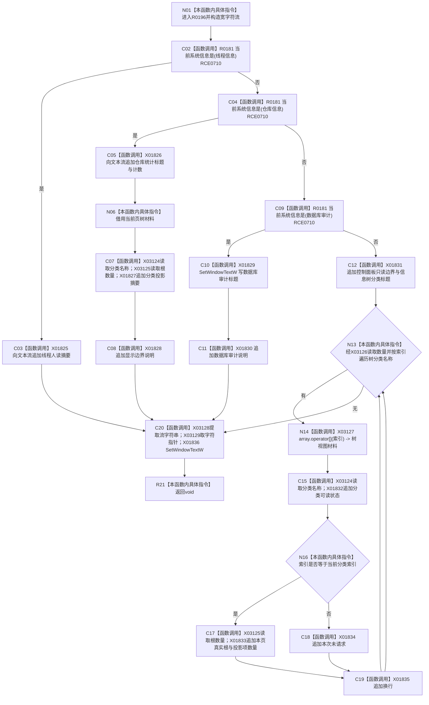

# CF-L9-0027 更新系统信息页现状流程图

图类型：现状流程图
代码版本：`3920a74638264f9f539d50f32f3c9fe5fb1982ab`
源码 blob：`fe9dad1eb3728c823beccf305c783be96a3df33d`
覆盖文件：`海中鱼巣/界面/控制面板窗口.cpp:785-859`
唯一根函数：R0196
完整签名：`void 海中鱼巣::控制面板窗口::窗口实现::更新系统信息页() const`
参数：无显式参数；读取当前系统信息导航、快照、分类名称和分类索引
返回结果：`void`；组装人读文本并写入详情控件，数据库审计分支同时写标题
已登记调用方：RCE0715
直接项目函数：RCE0710 → R0181
外部边界：X01825—X01836、X03124—X03129；未解析项目调用：0
逐行映射表：`流程图/代码流程图/L9/CF-L9-0027_更新系统信息页_逐行代码映射表.md`
依据：关系发布基线 `010784a906e8283644a63a742151f6457a847c38` 与冻结源码
结构读写：只组装人读摘要并更新 Windows 文本控件
不得作为施工许可：是
不得宣称：系统信息页文本或统计数字裁决节点、关系、索引或线程机器事实

## 流程图

## 当前边界

- 815—816、842—844、849、858 行的数组 / 容器 / 流字符串调用已冻结为 X03124—X03129。
- 所有输出均为人读投影；当前代码未在本函数写入任何权威仓库结构。
