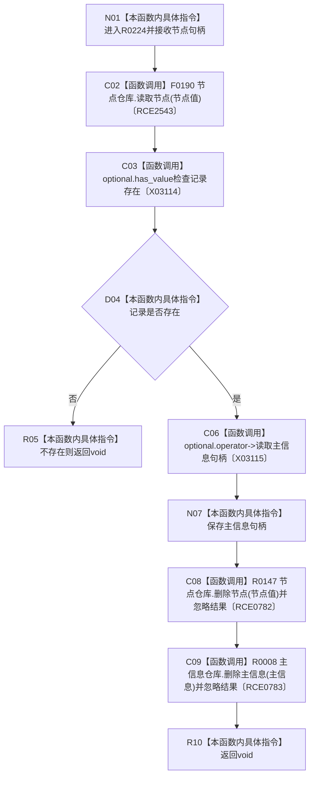

# CF-L9-0028 删除节点及主信息现状流程图

图类型：现状流程图
代码版本：`3920a74638264f9f539d50f32f3c9fe5fb1982ab`
源码 blob：`77edcb28282c0ec33e7c695e063b1605e4fb37bf`
覆盖文件：`海中鱼巣/领域/初始化.世界树.ixx:126-134`
唯一根函数：R0224
完整签名：`void 海中鱼巣::世界树初始化服务::删除节点及主信息(海中鱼巣::节点句柄 节点值)`
参数：节点句柄按值传入
返回结果：`void`
已登记调用方：RCE0786（R0225）
直接项目函数：F0190（RCE2543，`节点仓库::读取节点`）、R0147（RCE0782，删除节点）、R0008（RCE0783，删除主信息）
外部边界：X03114（`optional<节点记录>::has_value()`）、X03115（`optional<节点记录>::operator->()`）；未解析项目调用：0
调用图：`流程图/主程序可达调用关系/01_main可达项目调用边表.md`
逐行映射表：`流程图/代码流程图/L9/CF-L9-0028_删除节点及主信息_逐行代码映射表.md`
偏差清单：无
依据：RCE0786、RCE2543、RCE0782、RCE0783、X03114、X03115 与当前源码
结构读取与写入：读取节点记录；记录存在时先请求删除节点，再请求删除其主信息
逻辑内返回：记录不存在时返回 void
不得作为施工许可：是
不得宣称：函数返回证明节点和主信息都已删除；两个删除结果均被忽略

## 流程图

## 当前边界

- 节点读取失败时不尝试删除。
- 节点删除失败不会阻止后续主信息删除，且两个结果都被显式丢弃。
