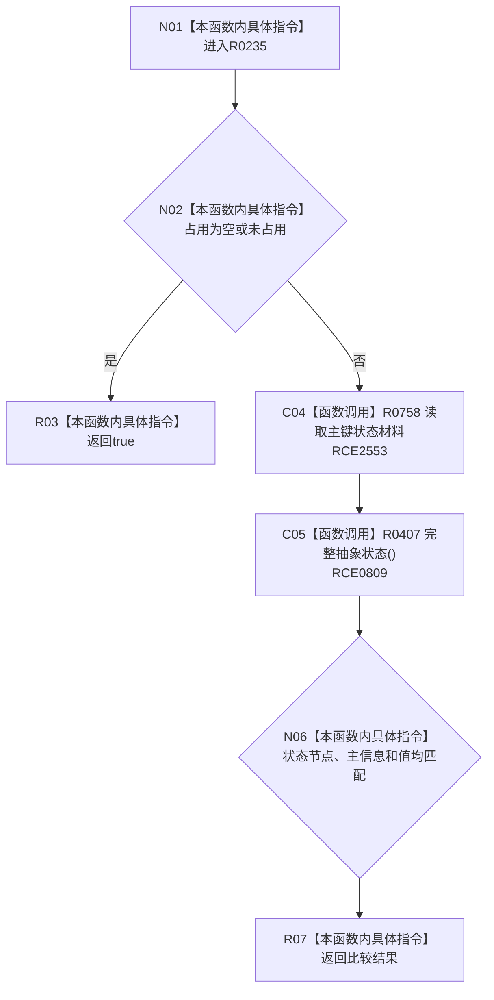

# CF-L9-0029 已有抽象状态匹配现状流程图

图类型：现状流程图
代码版本：`3920a74638264f9f539d50f32f3c9fe5fb1982ab`
源码 blob：`adf3fb33c53aa5aeaff2f7102bc9a4d7db3ba040`
覆盖文件：`海中鱼巣/领域/初始化.系统角色.ixx:425-432`
唯一根函数：R0235
完整签名：`bool 海中鱼巣::系统角色初始化器::已有抽象状态匹配(const 系统角色键占用材料* 占用, std::int64_t 预期值) const`
参数：占用为可空只读指针；预期值按值传入
返回结果：未占用时返回 `true`；已占用时返回状态材料匹配结果
已登记调用方：RCE0807（R0234）
直接项目函数：RCE2553 → R0758；RCE0809 → R0407
外部边界：无；未解析项目调用：0
逐行映射表：`流程图/代码流程图/L9/CF-L9-0029_已有抽象状态匹配_逐行代码映射表.md`
依据：关系发布基线 `dbe710096193fbd517edae5cb871decaf6b49bf3` 与冻结源码
结构读写：只读占用与状态材料
不得作为施工许可：是
不得宣称：返回真证明抽象状态已经存在

## 流程图

## 当前边界

- 429 行状态读取已绑定 RCE2553。
