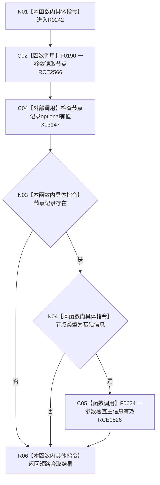

# CF-L9-0030 节点是基础信息现状流程图

图类型：现状流程图
代码版本：`3920a74638264f9f539d50f32f3c9fe5fb1982ab`
源码 blob：`ba08c07c9863ba369a9b2a782a323ea5b5d206a5`
覆盖文件：`海中鱼巣/领域/初始化.语素.ixx:191-196`
唯一根函数：R0242
完整签名：`bool 海中鱼巣::语素初始化服务::节点是基础信息(节点句柄 节点值) const`
参数：节点值按值传入
返回结果：节点存在、类型为基础信息且主信息有效时返回 `true`
已登记调用方：RCE0821（R0241）
直接项目函数：RCE2566 → F0190；RCE0826 → F0624
外部边界：X03147（193 行 `optional<节点记录>::has_value()`）；未解析项目调用：0
逐行映射表：`流程图/代码流程图/L9/CF-L9-0030_节点是基础信息_逐行代码映射表.md`
依据：关系发布基线 `dbe710096193fbd517edae5cb871decaf6b49bf3` 与冻结源码
结构读写：只读节点记录与主信息有效性
不得作为施工许可：是
不得宣称：返回真会创建基础信息

## 流程图

## 当前边界

- 源码两个仓库调用均已绑定一参数重载。
