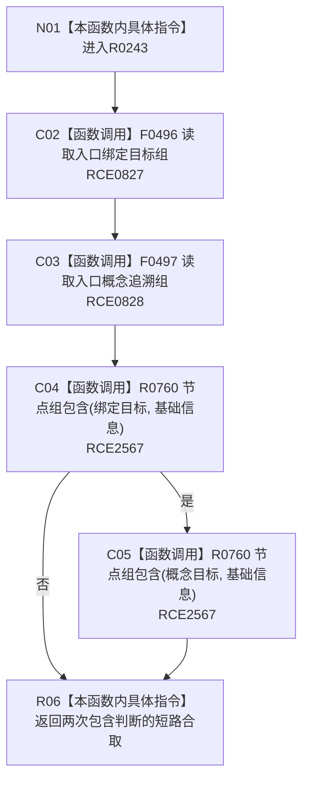

# CF-L9-0031 语素关系可读现状流程图

图类型：现状流程图
代码版本：`3920a74638264f9f539d50f32f3c9fe5fb1982ab`
源码 blob：`ba08c07c9863ba369a9b2a782a323ea5b5d206a5`
覆盖文件：`海中鱼巣/领域/初始化.语素.ixx:198-203`
唯一根函数：R0243
完整签名：`bool 海中鱼巣::语素初始化服务::语素关系可读(const 语素初始化显示项& 项) const`
参数：项为只读借用
返回结果：入口绑定目标组和概念追溯组都包含基础信息时返回 `true`
已登记调用方：RCE0824（R0241）
直接项目函数：RCE0827 → F0496；RCE0828 → F0497；RCE2567 → R0760
外部边界：无；未解析项目调用：0
逐行映射表：`流程图/代码流程图/L9/CF-L9-0031_语素关系可读_逐行代码映射表.md`
依据：关系发布基线 `dbe710096193fbd517edae5cb871decaf6b49bf3` 与冻结源码
结构读写：只读语素关系投影
不得作为施工许可：是
不得宣称：返回真证明关系由本函数写入

## 流程图

## 当前边界

- `初始化.语素.ixx:205-212` 的本类辅助函数已登记为 R0760；两个调用点合并登记为 RCE2567。
