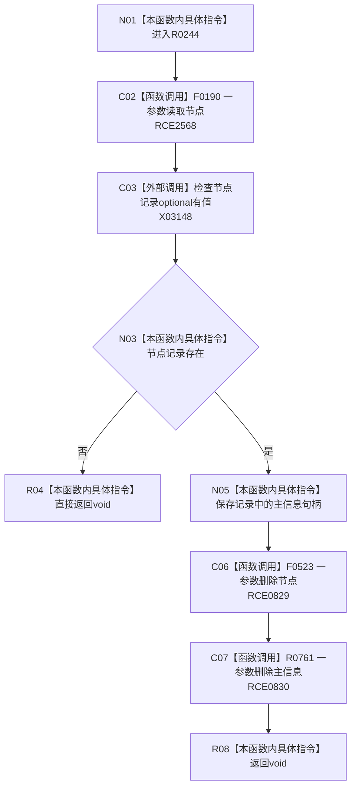

# CF-L9-0032 删除节点及主信息现状流程图

图类型：现状流程图
代码版本：`3920a74638264f9f539d50f32f3c9fe5fb1982ab`
源码 blob：`ba08c07c9863ba369a9b2a782a323ea5b5d206a5`
覆盖文件：`海中鱼巣/领域/初始化.语素.ixx:214-222`
唯一根函数：R0244
完整签名：`void 海中鱼巣::语素初始化服务::删除节点及主信息(节点句柄 节点值)`
参数：节点值按值传入
返回结果：`void`；节点不存在时直接返回，否则依次尝试删除节点和主信息
已登记调用方：RCE0822（R0241）；RCE0835（R0245）
直接项目函数：RCE2568 → F0190；RCE0829 → F0523；RCE0830 → R0761
外部边界：X03148（216 行 `optional<节点记录>::has_value()`）；未解析项目调用：0
逐行映射表：`流程图/代码流程图/L9/CF-L9-0032_删除节点及主信息_逐行代码映射表.md`
依据：关系发布基线 `dbe710096193fbd517edae5cb871decaf6b49bf3` 与冻结源码
结构读写：读取节点后删除节点与主信息；删除结果被丢弃
不得作为施工许可：是
不得宣称：函数返回证明两项删除成功

## 流程图

## 当前边界

- 215、220、221 行均已绑定一参数公开重载。
