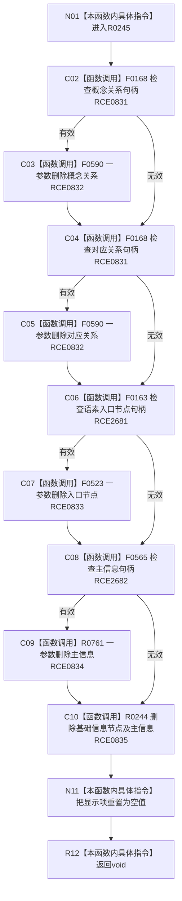

# CF-L9-0033 清理语素显示项现状流程图

图类型：现状流程图
代码版本：`3920a74638264f9f539d50f32f3c9fe5fb1982ab`
源码 blob：`ba08c07c9863ba369a9b2a782a323ea5b5d206a5`
覆盖文件：`海中鱼巣/领域/初始化.语素.ixx:224-239`
唯一根函数：R0245
完整签名：`void 海中鱼巣::语素初始化服务::清理显示项(语素初始化显示项& 项)`
参数：项为可写借用
返回结果：`void`；按句柄有效性尝试删除关系、节点、主信息和基础信息，最后清空项
已登记调用方：RCE0825（R0241）；RCE0836（R0246）
直接项目函数：RCE0831 → F0168；RCE2681 → F0163；RCE2682 → F0565；RCE0832 → F0590；RCE0833 → F0523；RCE0834 → R0761；RCE0835 → R0244
外部边界：无；未解析项目调用：0
逐行映射表：`流程图/代码流程图/L9/CF-L9-0033_清理语素显示项_逐行代码映射表.md`
依据：关系发布基线 `dbe710096193fbd517edae5cb871decaf6b49bf3` 与冻结源码
结构读写：条件删除语素关系、入口节点、主信息和基础信息；删除结果被丢弃
不得作为施工许可：是
不得宣称：清空局部项证明所有结构删除成功

## 流程图

## 当前边界

- RCE0831 只保留两个关系句柄调用；节点与主信息句柄调用分别登记为 RCE2681、RCE2682。
