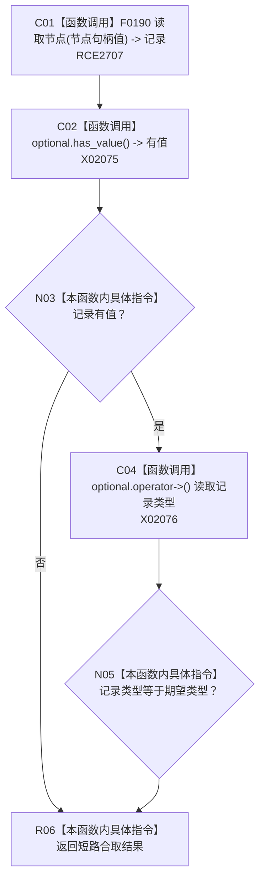

# CF-L9-0034 节点类型匹配现状流程图

图类型：现状流程图
代码版本：`3920a74638264f9f539d50f32f3c9fe5fb1982ab`
源码 blob：`ae4a5c34a3a725f7b2cd53e994ed0bec655a36b5`
覆盖文件：`海中鱼巣/领域/场景服务.h:57-60`
唯一根函数：R0276
完整签名：`bool 海中鱼巣::场景服务::节点类型匹配(节点句柄 节点句柄值, 节点类型 类型) const`
参数：节点句柄值和期望节点类型均按值传入
返回结果：节点记录存在且记录类型等于期望类型时返回真，否则返回假
已登记调用方：RCE0892（R0275）；RCE2413（R0738）
直接项目函数：RCE2707 → F0190
外部边界：X02075、X02076；未解析项目调用：0
逐行映射表：`流程图/代码流程图/L9/CF-L9-0034_节点类型匹配_逐行代码映射表.md`
依据：关系发布基线 `57c7ef1a4dc96083bd5ea570400c90cae5eaefc5` 与冻结源码
结构读写：只读节点仓库记录
不得作为施工许可：是
不得宣称：类型匹配证明节点的领域结构完整

## 流程图

## 当前边界

- `&&` 保持短路：记录无值时不会解引用 `optional`。
