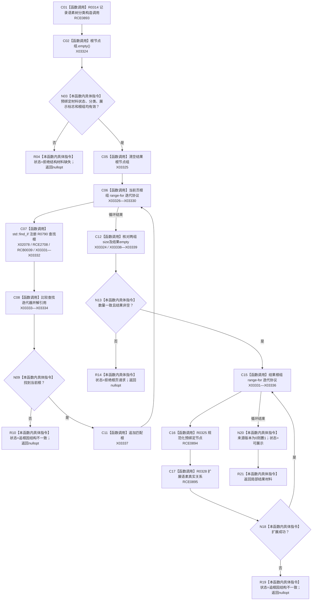

# CF-L9-0035 生成语素树现状流程图

图类型：现状流程图
代码版本：`3920a74638264f9f539d50f32f3c9fe5fb1982ab`
源码 blob：`b0b4cdc2cd7e7fd6801f36c7a43bc27595ca89d9`
覆盖文件：`海中鱼巣/领域/控制面板服务.h:1016-1058`
唯一根函数：R0278
完整签名：`std::optional<控制面板树结构材料> 海中鱼巣::控制面板服务::生成语素树(const std::vector<节点句柄>& 当前页根组, 控制面板请求状态& 状态) const`
参数：当前页根组为只读借用；状态为可写引用
返回结果：材料完整且请求根全部匹配、扩展成功时返回语素树材料；否则返回 `nullopt` 并写拒绝或追根因状态
已登记调用方：RCE1000（R0307）
直接项目函数：RCE0893 → R0314；RCE2708 → R0790；RCE0894 → R0325；RCE0895 → R0328
外部边界：X02078、X03324—X03339；回调登记：RCB0039；未解析项目调用：0
逐行映射表：`流程图/代码流程图/L9/CF-L9-0035_生成语素树_逐行代码映射表.md`
依据：关系发布基线 `57c7ef1a4dc96083bd5ea570400c90cae5eaefc5` 与冻结源码
结构读写：只复制并改写局部树材料，不写权威仓库
不得作为施工许可：是
不得宣称：返回材料证明语素权威关系已修改

## 流程图

## 当前边界

- 失败分支只改变输出状态和局部材料，不写节点、关系或索引。
