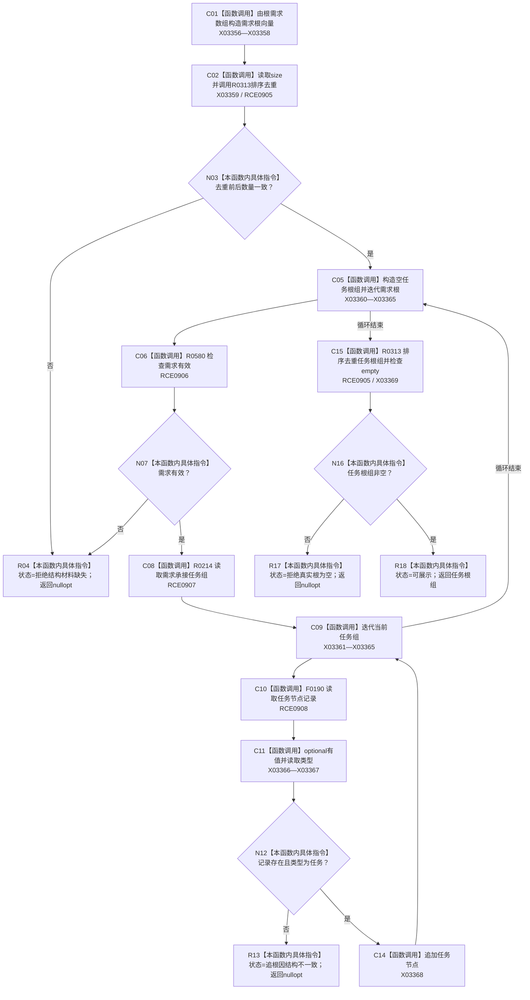

# CF-L9-0036 发现任务根组现状流程图

图类型：现状流程图
代码版本：`3920a74638264f9f539d50f32f3c9fe5fb1982ab`
源码 blob：`b0b4cdc2cd7e7fd6801f36c7a43bc27595ca89d9`
覆盖文件：`海中鱼巣/领域/控制面板服务.h:1207-1239`
唯一根函数：R0283
完整签名：`std::optional<std::vector<节点句柄>> 海中鱼巣::控制面板服务::发现任务根组(控制面板请求状态& 状态) const`
参数：状态为可写引用
返回结果：需求根唯一且所有承接任务记录有效、去重后非空时返回任务根组；否则返回空并写状态
已登记调用方：RCE0996（R0307）
直接项目函数：RCE0905 → R0313；RCE0906 → R0580；RCE0907 → R0214；RCE0908 → F0190
外部边界：X03356—X03369；未解析项目调用：0
逐行映射表：`流程图/代码流程图/L9/CF-L9-0036_发现任务根组_逐行代码映射表.md`
依据：关系发布基线 `57c7ef1a4dc96083bd5ea570400c90cae5eaefc5` 与冻结源码
结构读写：只读需求、任务和节点记录；构造局部任务根组
不得作为施工许可：是
不得宣称：返回任务根组证明任务树材料完整

## 流程图

## 当前边界

- 节点记录缺失或类型错误发生在已读取承接任务后，代码标记为结构不一致。
