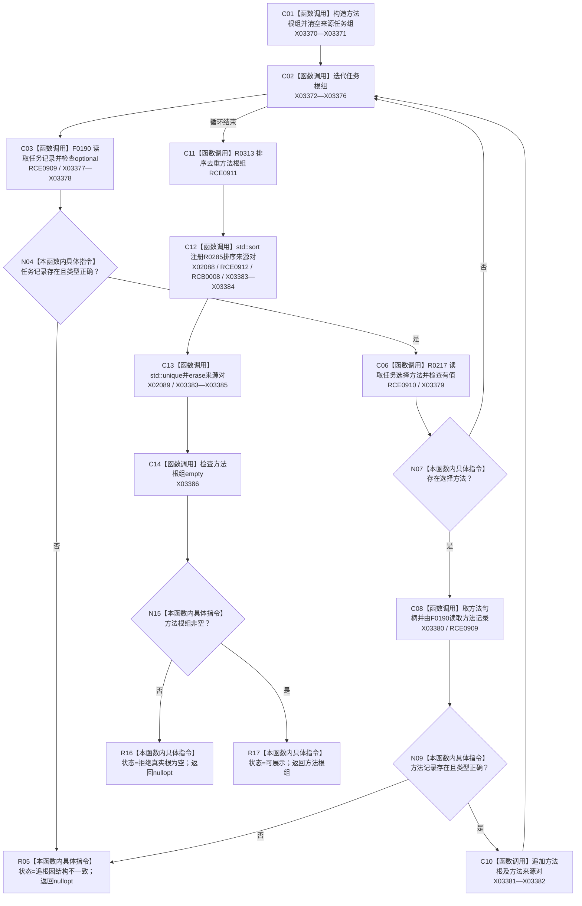

# CF-L9-0037 发现方法根组现状流程图

图类型：现状流程图
代码版本：`3920a74638264f9f539d50f32f3c9fe5fb1982ab`
源码 blob：`b0b4cdc2cd7e7fd6801f36c7a43bc27595ca89d9`
覆盖文件：`海中鱼巣/领域/控制面板服务.h:1241-1284`
唯一根函数：R0284
完整签名：`std::optional<std::vector<节点句柄>> 海中鱼巣::控制面板服务::发现方法根组(const std::vector<节点句柄>& 任务根组, std::vector<std::pair<节点句柄, 节点句柄>>& 方法来源任务组, 控制面板请求状态& 状态) const`
参数：任务根组只读借用；方法来源任务组和状态为可写引用
返回结果：有效任务选择到的方法经排序去重后非空时返回方法根组，并输出去重的方法来源对；否则返回空
已登记调用方：RCE0997（R0307）
直接项目函数：RCE0909 → F0190；RCE0910 → R0217；RCE0911 → R0313；RCE0912 → R0285
外部边界：X02088、X02089、X03370—X03386；回调登记：RCB0008；未解析项目调用：0
逐行映射表：`流程图/代码流程图/L9/CF-L9-0037_发现方法根组_逐行代码映射表.md`
依据：关系发布基线 `57c7ef1a4dc96083bd5ea570400c90cae5eaefc5` 与冻结源码
结构读写：只读任务和节点记录；改写输出方法来源任务组和局部方法根组
不得作为施工许可：是
不得宣称：返回方法根组证明方法候选材料完整

## 流程图

## 当前边界

- X02090 原误挂到 R0285，本批停用；外层排序只登记在 R0284。
