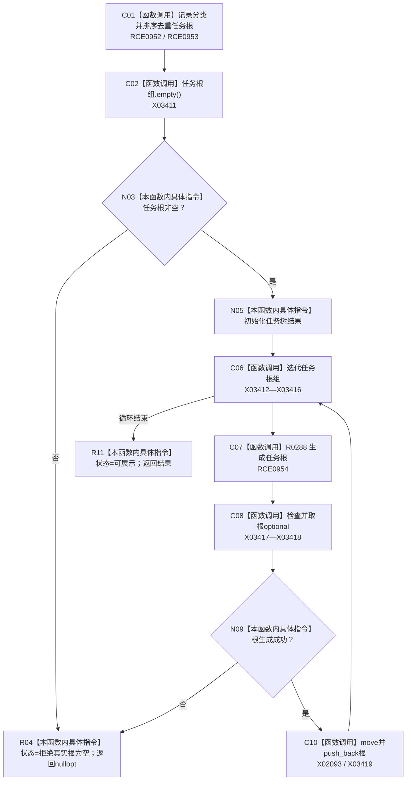

# CF-L9-0039 生成任务树现状流程图

图类型：现状流程图
代码版本：`3920a74638264f9f539d50f32f3c9fe5fb1982ab`
源码 blob：`b0b4cdc2cd7e7fd6801f36c7a43bc27595ca89d9`
覆盖文件：`海中鱼巣/领域/控制面板服务.h:1452-1476`
唯一根函数：R0289
完整签名：`std::optional<控制面板树结构材料> 海中鱼巣::控制面板服务::生成任务树(std::vector<节点句柄> 任务根组, 控制面板请求状态& 状态) const`
参数：任务根组按值传入并可局部重排；状态为可写引用
返回结果：任务根非空且全部任务根生成成功时返回任务树材料，否则返回空
已登记调用方：RCE1002（R0307）
直接项目函数：RCE0952 → R0314；RCE0953 → R0313；RCE0954 → R0288
外部边界：X02093、X03411—X03419；未解析项目调用：0
逐行映射表：`流程图/代码流程图/L9/CF-L9-0039_生成任务树_逐行代码映射表.md`
依据：关系发布基线 `57c7ef1a4dc96083bd5ea570400c90cae5eaefc5` 与冻结源码
结构读写：构造局部任务树只读快照材料
不得作为施工许可：是
不得宣称：树材料返回证明任务均已完成

## 流程图

## 当前边界

- 任一任务根生成失败时不返回已追加的局部部分树。
