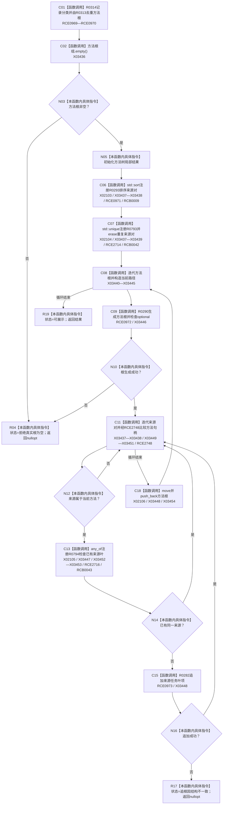

# CF-L9-0040 生成方法树现状流程图

图类型：现状流程图
代码版本：`3920a74638264f9f539d50f32f3c9fe5fb1982ab`
源码 blob：`b0b4cdc2cd7e7fd6801f36c7a43bc27595ca89d9`
覆盖文件：`海中鱼巣/领域/控制面板服务.h:1598-1657`
唯一根函数：R0292
完整签名：`std::optional<控制面板树结构材料> 海中鱼巣::控制面板服务::生成方法树(std::vector<节点句柄> 方法根组, std::vector<std::pair<节点句柄, 节点句柄>> 方法来源任务组, 控制面板请求状态& 状态, std::size_t 深度预算) const`
参数：两组向量按值传入；状态为可写引用；深度预算按值传入
返回结果：方法根非空且各根及来源任务叶项生成成功时返回方法树材料，否则返回空
已登记调用方：RCE1003（R0307）
直接项目函数：RCE0969 → R0314；RCE0970 → R0313；RCE0971 → R0293；RCE0972 → R0290；RCE0973 → R0282；RCE2714 → R0793；RCE2716 → R0794；RCE2748 → F0051
外部边界：X02103—X02106、X03436—X03454；回调登记：RCB0009、RCB0042、RCB0043；未解析项目调用：0
逐行映射表：`流程图/代码流程图/L9/CF-L9-0040_生成方法树_逐行代码映射表.md`
依据：关系发布基线 `57c7ef1a4dc96083bd5ea570400c90cae5eaefc5` 与冻结源码
结构读写：局部排序去重并构造方法树材料，不写权威结构
不得作为施工许可：是
不得宣称：方法树材料返回证明方法可执行

## 流程图

## 当前边界

- `std::unique` 的相等谓词和 `std::any_of` 的来源谓词均有独立函数图 R0793、R0794。
