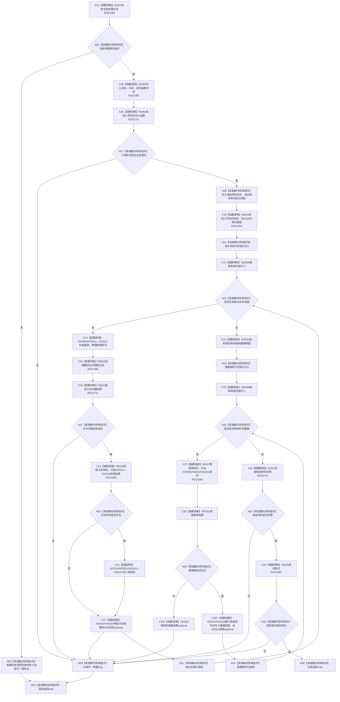

# CF-L9-0041 概念活动初始化全新活动lambda现状流程图

图类型：现状流程图
代码版本：`3920a74638264f9f539d50f32f3c9fe5fb1982ab`
源码 blob：`0a902454f56f7ee20e65f81ea6864e923a9c7f6a`
覆盖文件：`海中鱼巣/领域/数据操作.概念活动.ixx:63-120`
唯一根函数：R0341
完整签名：`void 海中鱼巣::概念活动数据操作::初始化全新活动(const 海中鱼巣::系统角色清单&, const 海中鱼巣::概念活动初始化参数&, const 海中鱼巣::抽象状态写入规格&, const 海中鱼巣::抽象状态写入规格&, const 海中鱼巣::抽象状态写入规格&, const std::array<海中鱼巣::概念签名材料, 4>&) const::<lambda@数据操作.概念活动.ixx:63>::operator()(海中鱼巣::结构写入会话& 会话) const`
参数：结构写入会话为可写引用；通过捕获访问参数、三项规格、根身份组、签名组、候选材料、发现预存结构和内部不一致
返回结果：`void`；通过外层引用写回标记和候选材料，并可请求当前会话提交
已登记调用方：R0116；回调注册方 R0340（RCB0014）
直接项目函数：RCE1080—RCE1086；RCE2741—RCE2743
外部边界：X03307—X03323
逐行映射表：`流程图/代码流程图/L9/CF-L9-0041_概念活动初始化全新活动lambda_逐行代码映射表.md`
依据：关系发布基线 `57c7ef1a4dc96083bd5ea570400c90cae5eaefc5` 与冻结源码
结构读写：在结构写入会话中复核前置、写入三项状态、创建四项生命周期关系、重建四项根材料，并在候选完整时请求提交
不得作为施工许可：是
不得宣称：请求提交成功等同执行器最终返回已提交

## 流程图

## 当前边界

- 关系创建、关系材料读取或根重建任一失败均写回 `内部不一致=true` 并提前结束回调。
- 本函数只调用 `会话.请求提交()`；最终事务状态仍由 R0116 在外层返回。
