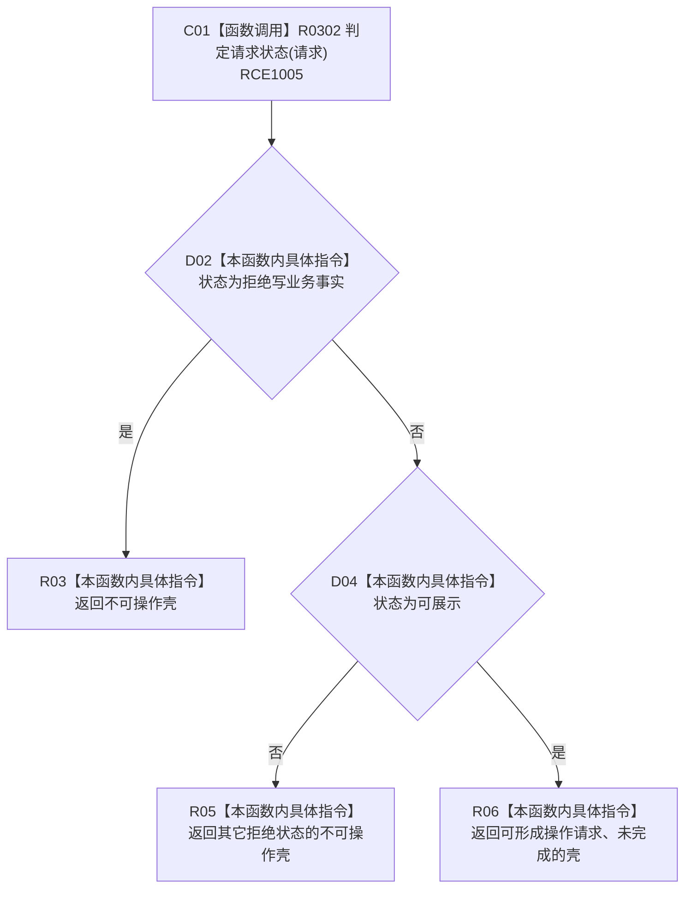

# CF-L9-0042 生成操作请求壳现状流程图

图类型：现状流程图
代码版本：`3920a74638264f9f539d50f32f3c9fe5fb1982ab`
源码 blob：`b0b4cdc2cd7e7fd6801f36c7a43bc27595ca89d9`
覆盖文件：`海中鱼巣/领域/控制面板服务.h:554-563`
唯一根函数：R0308
完整签名：`控制面板操作请求材料 海中鱼巣::控制面板服务::生成操作请求壳(const 控制面板请求& 请求) const`
参数：控制面板请求以 const 引用借用
返回结果：写事实请求和其它非可展示请求均返回不可操作壳；可展示请求返回允许形成操作请求但尚未完成
已登记调用方：R0165（RCE0664）
直接项目函数：R0302（RCE1005）
外部边界：无
逐行映射表：`流程图/代码流程图/L9/CF-L9-0042_生成操作请求壳_逐行代码映射表.md`
依据：冻结源码与既有项目边
结构读写：无，只构造操作请求人读壳
不得作为施工许可：是
不得宣称：返回壳允许写业务事实或表示操作完成

## 流程图

## 当前边界

- `true` 字段只表示可形成请求壳，不授予业务写入或操作执行许可。
