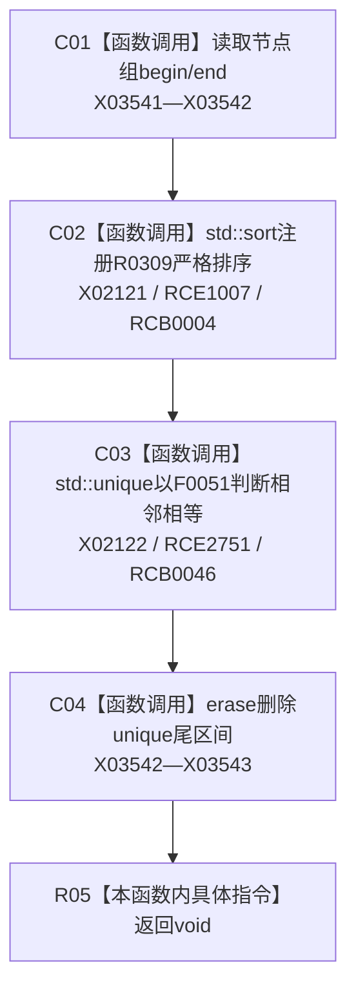

# CF-L9-0043 排序去重节点组现状流程图

图类型：现状流程图
代码版本：`3920a74638264f9f539d50f32f3c9fe5fb1982ab`
源码 blob：`b0b4cdc2cd7e7fd6801f36c7a43bc27595ca89d9`
覆盖文件：`海中鱼巣/领域/控制面板服务.h:625-628`
唯一根函数：R0313
完整签名：`static void 海中鱼巣::控制面板服务::排序去重节点组(std::vector<节点句柄>& 节点组)`
参数：节点组为可写引用，函数原地排序并删除相邻重复项
返回结果：`void`，结果写回节点组
已登记调用方：RCE0905、RCE0911、RCE0933、RCE0937、RCE0953、RCE0960、RCE0970、RCE0995、RCE1011、RCE1022、RCE1034、RCE1039、RCE1046
直接项目函数：RCE1007 → R0309；RCE2751 → F0051；外部边界：X02121—X02122、X03541—X03543；回调：RCB0004、RCB0046
逐行映射表：`流程图/代码流程图/L9/CF-L9-0043_排序去重节点组_逐行代码映射表.md`
依据：冻结源码与当前正式调用关系
结构读写：原地改写传入向量，不写项目权威结构
不得作为施工许可：是
不得宣称：去重完成证明每个节点句柄有效

## 流程图

## 当前边界

- 当前聚合表已登记排序回调，但缺少 `std::unique` 默认相等路径对 F0051 的项目回调。
