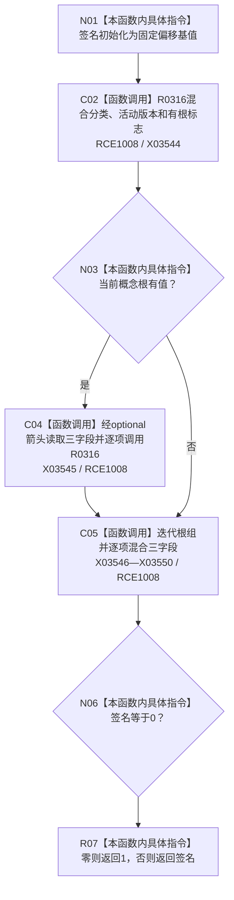

# CF-L9-0044 计算根集签名现状流程图

图类型：现状流程图
代码版本：`3920a74638264f9f539d50f32f3c9fe5fb1982ab`
源码 blob：`b0b4cdc2cd7e7fd6801f36c7a43bc27595ca89d9`
覆盖文件：`海中鱼巣/领域/控制面板服务.h:659-679`
唯一根函数：R0317
完整签名：`static std::uint64_t 海中鱼巣::控制面板服务::计算根集签名(控制面板树分类 分类, const std::optional<节点句柄>& 当前概念根, std::uint64_t 概念活动版本, const std::vector<节点句柄>& 根组)`
参数：分类和版本按值传入；当前概念根与根组为只读引用
返回结果：返回混合后的非零 64 位签名；计算值为零时返回 1
已登记调用方：RCE0998（R0307）、RCE1026（R0321）
直接项目函数：RCE1008 → R0316；外部边界：X03544—X03550；未解析项目调用：0
逐行映射表：`流程图/代码流程图/L9/CF-L9-0044_计算根集签名_逐行代码映射表.md`
依据：冻结源码与当前正式调用关系
结构读写：无，只构造局部签名
不得作为施工许可：是
不得宣称：非零签名证明根组有效、唯一或未漂移

## 流程图

## 当前边界

- 根组顺序会影响签名；调用方负责在需要时先排序去重。
