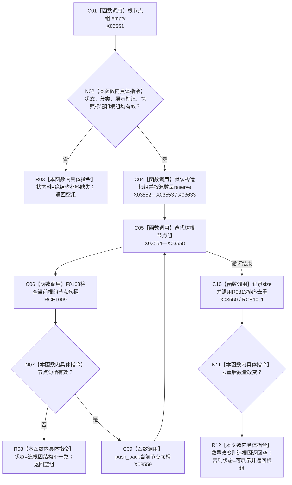

# CF-L9-0045 读取预绑定根组现状流程图

图类型：现状流程图
代码版本：`3920a74638264f9f539d50f32f3c9fe5fb1982ab`
源码 blob：`b0b4cdc2cd7e7fd6801f36c7a43bc27595ca89d9`
覆盖文件：`海中鱼巣/领域/控制面板服务.h:681-710`
唯一根函数：R0318
完整签名：`std::vector<节点句柄> 海中鱼巣::控制面板服务::读取预绑定根组(const 控制面板树结构材料& 树, 控制面板树分类 预期分类, 控制面板请求状态& 状态) const`
参数：树为只读引用；预期分类按值传入；状态为可写引用
返回结果：材料完整且根句柄有效、无重复时返回根组；入口材料缺失或内部不一致时返回空组并写状态
已登记调用方：RCE0994（R0307）
直接项目函数：RCE1009 → F0163、RCE1011 → R0313；RCE1010 → F0168 为误绑并停用
外部边界：X03551—X03560、X03633；未解析项目调用：0
逐行映射表：`流程图/代码流程图/L9/CF-L9-0045_读取预绑定根组_逐行代码映射表.md`
依据：冻结源码、字段静态类型与当前正式调用关系
结构读写：只读预绑定树，构造局部根组并改写输出状态
不得作为施工许可：是
不得宣称：返回根组证明树中全部子节点或业务关系有效

## 流程图

## 当前边界

- 第 696 行实参静态类型是 `节点句柄`，只匹配 F0163；RCE1010 对 F0168（关系句柄）的绑定无类型依据。
