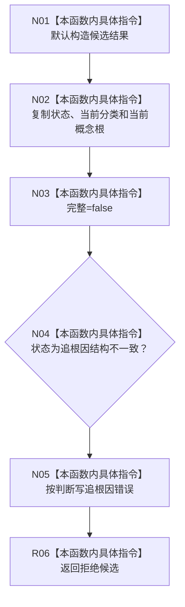

# CF-L9-0046 拒绝按需树候选现状流程图

图类型：现状流程图
代码版本：`3920a74638264f9f539d50f32f3c9fe5fb1982ab`
源码 blob：`b0b4cdc2cd7e7fd6801f36c7a43bc27595ca89d9`
覆盖文件：`海中鱼巣/领域/控制面板服务.h:712-722`
唯一根函数：R0319
完整签名：`static 控制面板按需树候选材料 海中鱼巣::控制面板服务::拒绝按需树候选(const 控制面板按需树请求& 请求, 控制面板请求状态 状态)`
参数：请求为只读引用；状态按值传入
返回结果：返回不完整候选；仅“追根因结构不一致”状态设置追根因错误
已登记调用方：RCE0992（R0307）、RCE1012（R0320）、RCE1017（R0321）
直接项目函数：无；外部边界：无；未解析项目调用：0
逐行映射表：`流程图/代码流程图/L9/CF-L9-0046_拒绝按需树候选_逐行代码映射表.md`
依据：冻结源码与当前正式调用关系
结构读写：只构造局部候选材料
不得作为施工许可：是
不得宣称：拒绝材料已修复请求或内部结构问题

## 流程图

## 当前边界

- 本函数不改变请求，也不写任何项目仓库；拒绝原因完全由调用方传入状态决定。
