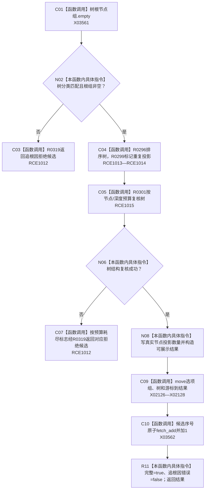

# CF-L9-0047 完成按需树候选现状流程图

图类型：现状流程图
代码版本：`3920a74638264f9f539d50f32f3c9fe5fb1982ab`
源码 blob：`b0b4cdc2cd7e7fd6801f36c7a43bc27595ca89d9`
覆盖文件：`海中鱼巣/领域/控制面板服务.h:724-759`
唯一根函数：R0320
完整签名：`控制面板按需树候选材料 海中鱼巣::控制面板服务::完成按需树候选(const 控制面板按需树请求& 请求, 控制面板树结构材料 树, std::vector<控制面板概念根选项> 概念根选项组, std::optional<节点句柄> 当前概念根, std::uint64_t 概念活动版本, std::optional<控制面板根页游标> 下一页游标) const`
参数：请求为只读引用；树、概念根选项组、当前根、版本和下一页游标按值传入
返回结果：树通过复核时返回完整可展示候选；结构、预算或复核失败时返回 R0319 构造的拒绝候选
已登记调用方：RCE1004（R0307）、RCE1030（R0321）
直接项目函数：RCE1012 → R0319、RCE1013 → R0296、RCE1014 → R0299、RCE1015 → R0301
外部边界：X02126—X02128、X03561—X03562；未解析项目调用：0
逐行映射表：`流程图/代码流程图/L9/CF-L9-0047_完成按需树候选_逐行代码映射表.md`
依据：冻结源码与当前正式调用关系
结构读写：改写按值传入的局部树并构造局部候选；递增内存候选序号
不得作为施工许可：是
不得宣称：候选完整证明底层业务能力或权威结构完成

## 流程图

## 当前边界

- 预算耗尽走协议拒绝；非预算的复核失败标为追根因结构不一致。
