# CF-L9-0048 生成当前概念根树现状流程图

图类型：现状流程图
代码版本：`3920a74638264f9f539d50f32f3c9fe5fb1982ab`
源码 blob：`b0b4cdc2cd7e7fd6801f36c7a43bc27595ca89d9`
覆盖文件：`海中鱼巣/领域/控制面板服务.h:761-870`
唯一根函数：R0321
完整签名：`控制面板按需树候选材料 海中鱼巣::控制面板服务::生成当前概念根树(const 控制面板按需树请求& 请求) const`
参数：请求为只读引用
返回结果：活动概念图、根登记、抽象视图和树转换全部一致时返回完整候选；协议拒绝或内部结构异常时返回 R0319 构造的拒绝候选
已登记调用方：RCE0993（R0307）
直接项目函数：RCE1016—RCE1030；新增 RCE2752 → R0796、RCE2754 → F0051
外部边界：X02129—X02137、X03563—X03591、X03634—X03637；回调：RCB0005—RCB0006、RCB0047；未解析项目调用：0
逐行映射表：`流程图/代码流程图/L9/CF-L9-0048_生成当前概念根树_逐行代码映射表.md`
依据：冻结源码、当前正式调用关系与本批直接闭包复核
结构读写：只读概念图和节点仓库，构造局部显示候选
不得作为施工许可：是
不得宣称：树候选生成证明概念活动业务闭环或底层结构规范符合

## 流程图

```mermaid
flowchart TD
    C01["C01【函数调用】R0314记录概念树分类构造<br/>RCE1016"]
    C02["C02【函数调用】检查继续游标has_value<br/>X03563"]
    N03{"N03【本函数内具体指令】请求包含继续游标？"}
    C04["C04【函数调用】R0319返回游标失效拒绝<br/>RCE1017"]
    C05["C05【函数调用】读取活动版本、全部根登记和活动根组<br/>RCE1018—RCE1020"]
    C06["C06【函数调用】读取两组size<br/>X03564—X03565"]
    N07{"N07【本函数内具体指令】版本非零且两组均为4项？"}
    C08["C08【函数调用】R0319返回活动图未就绪<br/>RCE1017"]
    C09["C09【函数调用】std::sort注册R0322排序根登记<br/>X02129 / RCE1021 / RCB0005 / X03566—X03567"]
    C10["C10【函数调用】R0313排序去重活动根组<br/>RCE1022"]
    C11["C11【函数调用】默认构造并reserve登记根组和根选项组<br/>X03564 / X03568—X03569 / X03634—X03635"]
    N12{"N12【本函数内具体指令】还有根登记索引？"}
    C13["C13【函数调用】operator[]取登记并由F0190读取根节点<br/>X03570 / RCE1023"]
    C14["C14【函数调用】检查节点optional并读取类型<br/>X03571—X03572"]
    N15{"N15【本函数内具体指令】类别、节点存在性和类型均符合？"}
    C16["C16【函数调用】R0319返回追根因结构不一致<br/>RCE1017"]
    C17["C17【函数调用】push根句柄并由R0315、to_wstring形成显示名<br/>X03573—X03576 / X03636 / RCE1024 / X02130—X02133"]
    C18["C18【函数调用】复制登记根组并由R0313排序去重<br/>X03577 / RCE1022"]
    C19["C19【函数调用】vector比较触发F0051逐元素相等<br/>X03578 / RCE2754"]
    C20["C20【函数调用】std::all_of注册R0323检查选项完整<br/>X02134 / RCE1025 / RCB0006 / X03579—X03580"]
    N21{"N21【本函数内具体指令】登记根、活动根和全部选项一致完整？"}
    C22["C22【函数调用】按请求optional选择当前根或front默认根<br/>X03581—X03583"]
    C23["C23【函数调用】std::find_if注册R0796查找当前根登记并与end比较<br/>X02135 / RCE2752 / RCB0047 / X03566—X03567 / X03584"]
    N24{"N24【本函数内具体指令】当前根存在于登记组？"}
    C25["C25【函数调用】R0317计算当前根签名<br/>RCE1026 / X03585—X03586"]
    N26{"N26【本函数内具体指令】根签名为0？"}
    C27["C27【函数调用】R0517读取抽象树视图结果<br/>RCE1027"]
    C28["C28【函数调用】R0530判断读取正常成功<br/>RCE1028"]
    N29{"N29【本函数内具体指令】读取正常成功？"}
    N30{"N30【本函数内具体指令】按读取状态分派拒绝原因"}
    C31["C31【函数调用】R0319返回未就绪/非活动/预算/追根因拒绝<br/>RCE1017"]
    C32["C32【函数调用】检查视图optional、版本并取value<br/>X03587—X03589"]
    N33{"N33【本函数内具体指令】读取版本与视图版本均等于活动版本？"}
    N34{"N34【本函数内具体指令】经迭代器箭头读取当前登记；视图类别和根概念匹配？<br/>X03637"}
    C35["C35【函数调用】R0279转换概念树根<br/>RCE1029"]
    N36{"N36【本函数内具体指令】转换结果有根？"}
    N37["N37【本函数内具体指令】构造可展示只读树并写来源版本"]
    C38["C38【函数调用】取根value并move追加到树<br/>X03590—X03591 / X02136"]
    C39["C39【函数调用】R0320移动树和选项组完成候选<br/>RCE1030 / X02137"]
    C01 --> C02 --> N03
    N03 -- 是 --> C04
    N03 -- 否 --> C05 --> C06 --> N07
    N07 -- 否 --> C08
    N07 -- 是 --> C09 --> C10 --> C11 --> N12
    N12 -- 是 --> C13 --> C14 --> N15
    N15 -- 否 --> C16
    N15 -- 是 --> C17 --> N12
    N12 -- 否 --> C18 --> C19 --> C20 --> N21
    N21 -- 否 --> C16
    N21 -- 是 --> C22 --> C23 --> N24
    N24 -- 否 --> C04
    N24 -- 是 --> C25 --> N26
    N26 -- 是 --> C16
    N26 -- 否 --> C27 --> C28 --> N29
    N29 -- 否 --> N30 --> C31
    N29 -- 是 --> C32 --> N33
    N33 -- 否 --> C04
    N33 -- 是 --> N34
    N34 -- 否 --> C16
    N34 -- 是 --> C35 --> N36
    N36 -- 否 --> C31
    N36 -- 是 --> N37 --> C38 --> C39
```

## 当前边界

- `控制面板服务.h:818-820` 的 `std::find_if` 谓词是独立当前可达 lambda，临时身份 R0796；其经 RCE2753 调用 F0051 比较登记根节点。正式聚合表尚未建该身份、两条调用边和回调登记。
- `排序登记根组 != 活动根组` 的元素静态类型为 `节点句柄`，比较链应闭合到 F0051。
- X02137 同一行实际有两次 `std::move`（树、根选项组），聚合记录的 `call_count` 应由 1 校正为 2。
