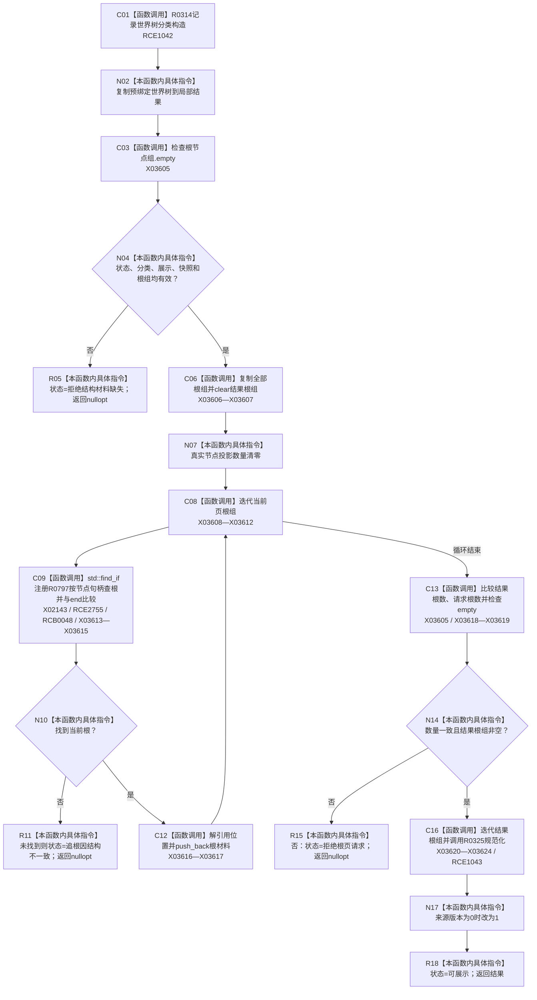

# CF-L9-0049 生成世界树现状流程图

图类型：现状流程图
代码版本：`3920a74638264f9f539d50f32f3c9fe5fb1982ab`
源码 blob：`b0b4cdc2cd7e7fd6801f36c7a43bc27595ca89d9`
覆盖文件：`海中鱼巣/领域/控制面板服务.h:935-972`
唯一根函数：R0326
完整签名：`std::optional<控制面板树结构材料> 海中鱼巣::控制面板服务::生成世界树(const std::vector<节点句柄>& 当前页根组, 控制面板请求状态& 状态) const`
参数：当前页根组为只读引用；状态为可写引用
返回结果：预绑定世界树完整且请求根均存在时返回规范化后的当前页树；材料缺失、请求根不一致或根页为空时返回 `nullopt`
已登记调用方：RCE0999（R0307）
直接项目函数：RCE1042 → R0314、RCE1043 → R0325；新增 RCE2755 → R0797、RCE2756（R0797 → F0051）
外部边界：X02143、X03605—X03624；回调：RCB0048；未解析项目调用：0
逐行映射表：`流程图/代码流程图/L9/CF-L9-0049_生成世界树_逐行代码映射表.md`
依据：冻结源码、当前正式调用关系与直接闭包复核
结构读写：复制预绑定树并只改局部副本和输出状态
不得作为施工许可：是
不得宣称：返回世界树证明全部根材料来源有效或底层关系完整

## 流程图

## 当前边界

- `控制面板服务.h:953-955` 的 `std::find_if` 谓词是独立当前可达 lambda，临时身份 R0797；其中第 954 行节点句柄相等闭合到 F0051。
