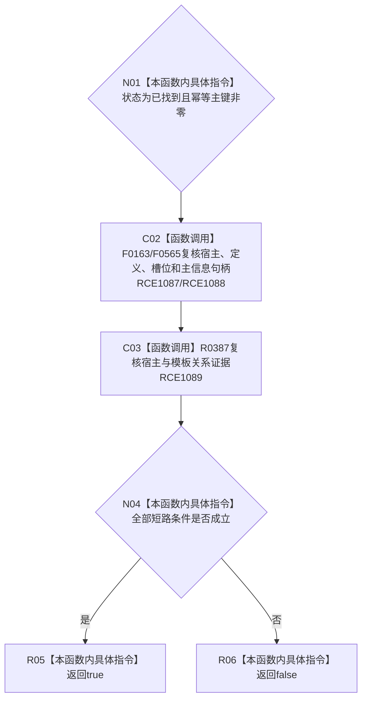

# CF-L9-0050 特征槽位值式材料完整现状流程图

图类型：现状流程图
代码版本：`3920a74638264f9f539d50f32f3c9fe5fb1982ab`
源码 blob：`a47cd9b07794d30abc6cb9d1df319056105cd596`
覆盖文件：`海中鱼巣/领域/数据操作.特征体系.ixx:102-107`
唯一根函数：R0343
完整签名：`bool 海中鱼巣::特征槽位值式材料::完整() const noexcept`
参数：无；只读当前材料
返回结果：状态、主键、四个句柄和两项关系证据全部有效时返回 `true`
直接项目函数：RCE1087—RCE1089
外部边界：无
逐行映射表：`流程图/代码流程图/L9/CF-L9-0050_特征槽位值式材料完整_逐行代码映射表.md`
不得作为施工许可：是

## 流程图

## 当前边界

- 完整性仅针对值式材料字段，不重新读取仓库。
