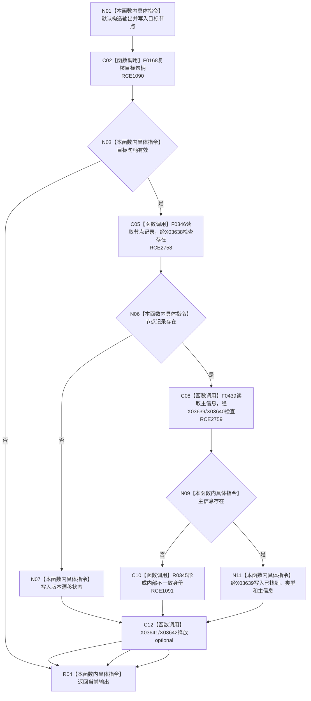

# CF-L9-0051 特征体系读取节点身份已许可现状流程图

图类型：现状流程图
代码版本：`3920a74638264f9f539d50f32f3c9fe5fb1982ab`
源码 blob：`a47cd9b07794d30abc6cb9d1df319056105cd596`
覆盖文件：`海中鱼巣/领域/数据操作.特征体系.ixx:1023-1041`
唯一根函数：R0344
完整签名：`海中鱼巣::特征节点身份 海中鱼巣::特征体系数据操作::读取节点身份_已许可(海中鱼巣::节点句柄 目标, const 海中鱼巣::结构事务令牌& 令牌) const`
直接项目函数：RCE1090—RCE1091；RCE2758—RCE2759
符号外部边界：X03638—X03642
逐行映射表：`流程图/代码流程图/L9/CF-L9-0051_特征体系读取节点身份已许可_逐行代码映射表.md`
不得作为施工许可：是

## 流程图

## 当前边界

- 本函数在既有令牌下只读节点与主信息；缺少节点为版本漂移，缺少主信息为内部不一致。
