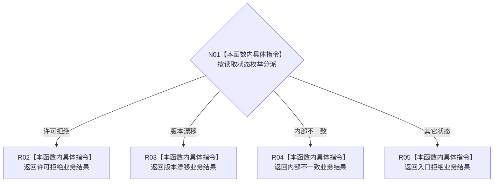

# CF-L9-0052 特征体系从读取失败形成结果现状流程图

图类型：现状流程图
代码版本：`3920a74638264f9f539d50f32f3c9fe5fb1982ab`
源码 blob：`a47cd9b07794d30abc6cb9d1df319056105cd596`
覆盖文件：`海中鱼巣/领域/数据操作.特征体系.ixx:1630-1641`
唯一根函数：R0367
完整签名：`static 海中鱼巣::特征体系业务结果 海中鱼巣::特征体系数据操作::从读取失败形成结果(海中鱼巣::特征体系读取状态 状态) noexcept`
参数：`状态` 按值传入
返回结果：把许可拒绝、版本漂移、内部不一致映射为同名业务状态，其它读取状态映射为入口拒绝
调用图：`流程图/主程序可达调用关系/01_main可达项目调用边表.md`
已登记调用方：R0389、R0701（RCE1229、RCE2084）
直接项目函数：无
外部边界：无
未解析项目调用：0
逐行映射表：`流程图/代码流程图/L9/CF-L9-0052_特征体系从读取失败形成结果_逐行代码映射表.md`
输入契约 / 调用语境表：本图“输入与返回边界”
非成功返回二分审查表：配对逐行映射的“非成功口径”
偏差清单：本批未裁决目标设计偏差；聚合关系纠正项只在批次交接中报告
依据提交 / 结构化消息：调用关系基线 `caab8644416dea13ea598b714289d1c86ac05304`；冻结源码提交 `3920a74638264f9f539d50f32f3c9fe5fb1982ab`
验证输出：本批 Mermaid、节点双向、源码覆盖与差异格式检查
结构读取与写入：只读按值状态，不改变机器结构
不得作为施工许可：是
不得宣称：返回内部不一致表示根因已经排除

## 流程图

## 输入与返回边界

- 本函数是读取状态到业务状态的纯映射；默认分支涵盖未找到、类型不匹配、已找到及其它未单列状态。
- 内部不一致结果仍属于需追根因的上游结构异常，不因映射为业务结果而转为普通入口拒绝。
