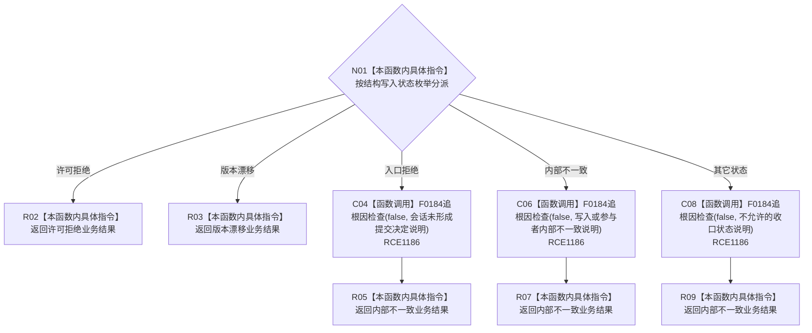

# CF-L9-0053 特征体系映射结构失败现状流程图

图类型：现状流程图
代码版本：`3920a74638264f9f539d50f32f3c9fe5fb1982ab`
源码 blob：`a47cd9b07794d30abc6cb9d1df319056105cd596`
覆盖文件：`海中鱼巣/领域/数据操作.特征体系.ixx:1643-1659`
唯一根函数：R0368
完整签名：`static 海中鱼巣::特征体系业务结果 海中鱼巣::特征体系数据操作::映射结构失败(const 海中鱼巣::结构写入结果& 结果)`
参数：`结果` 为只读借用引用；函数不延长其生命周期
返回结果：许可拒绝和版本漂移保持同名业务状态；入口拒绝、内部不一致及其它结构状态均记录追根因检查并返回内部不一致
调用图：`流程图/主程序可达调用关系/01_main可达项目调用边表.md`
已登记调用方：R0389、R0701（RCE1234、RCE2097）
直接项目函数：F0184（RCE1186，共三个调用点）
被调函数流程图：`流程图/代码流程图/L5/CF-L5-0064_追根因检查_现状流程图.md`
外部边界：无
未解析项目调用：0
逐行映射表：`流程图/代码流程图/L9/CF-L9-0053_特征体系映射结构失败_逐行代码映射表.md`
输入契约 / 调用语境表：本图“输入与返回边界”
非成功返回二分审查表：配对逐行映射的“非成功口径”
偏差清单：本批未裁决目标设计偏差；聚合关系纠正项只在批次交接中报告
依据提交 / 结构化消息：调用关系基线 `caab8644416dea13ea598b714289d1c86ac05304`；冻结源码提交 `3920a74638264f9f539d50f32f3c9fe5fb1982ab`
验证输出：本批 Mermaid、节点双向、源码覆盖与差异格式检查
结构读取与写入：只读结构写入结果；追根因检查在当前正式宏关闭变体不写机器结构
不得作为施工许可：是
不得宣称：调用追根因检查或返回内部不一致表示结构根因已经排除

## 流程图

## 输入与返回边界

- 许可拒绝和版本漂移是结构层允许传播的结果；本函数不追加诊断调用。
- 业务准入后结构会话仍返回入口拒绝、显式内部不一致或其它未允许状态时，当前代码统一调用 F0184 并映射为内部不一致。
- F0184 的布尔返回值被显式丢弃；它不参与本函数返回状态裁决。
