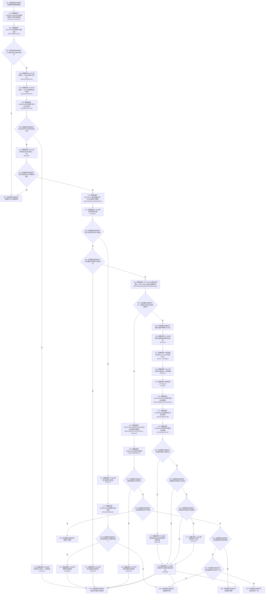

# CF-L9-0054 特征体系创建槽位并发布初始状态现状流程图

图类型：现状流程图
代码版本：`3920a74638264f9f539d50f32f3c9fe5fb1982ab`
源码 blob：`a47cd9b07794d30abc6cb9d1df319056105cd596`
覆盖文件：`海中鱼巣/领域/数据操作.特征体系.ixx:832-916`
唯一根函数：R0389
完整签名：`海中鱼巣::特征体系业务结果 海中鱼巣::特征体系数据操作::创建槽位并发布初始状态(const 海中鱼巣::特征槽位写入规格& 槽位规格, const 海中鱼巣::初始特征值写入规格& 值规格) const`
参数：`槽位规格`、`值规格` 均为调用期只读借用；函数不延长其生命周期
返回结果：返回已提交、幂等读回、入口拒绝、幂等冲突、许可拒绝、版本漂移或内部不一致的强类型业务结果
调用图：`流程图/主程序可达调用关系/01_main可达项目调用边表.md`
逐行映射表：`流程图/代码流程图/L9/CF-L9-0054_特征体系创建槽位并发布初始状态_逐行代码映射表.md`
输入契约 / 调用语境表：调用方 R0566 提供两份已形成规格；本函数仍在首笔写入前重验完整性、身份、宿主类型、幂等键与现有结构
非成功返回二分审查表：写前拒绝、幂等读回、幂等冲突、许可拒绝和版本竞争为具名逻辑结果；前置通过后的候选写入、撤销、发布或读回异常为追根因对象
偏差清单：补 RCE2789—RCE2792、RCE2795、RCE2803—RCE2804、X03757—X03758；新增直接身份 R0798、R0799
依据提交 / 结构化消息：聚合关系基线 `caab8644416dea13ea598b714289d1c86ac05304`；冻结源码提交 `3920a74638264f9f539d50f32f3c9fe5fb1982ab`
验证输出：本批 Mermaid、节点双向、源码覆盖与差异格式检查
不得作为施工许可：是
不得宣称：执行器返回、回调请求提交或事务外读回任一单项独立证明完整结构已经发布

## 流程图

## 回调、事务与 RAII 边界

- line 885 的 R0391 是独立函数身份；R0389 通过 RCB0019 注册它并经 X03757 构造临时 `std::function`，R0103 转交执行，实际回调调用方是 R0102。
- `特征值原始材料事务参与者` 从 line 884 构造后存续到 R0389 离开作用域；RCE2804 覆盖所有正常、提前和异常退出。R0799 是源码显式 defaulted 析构，按现行 R0749 口径不把三个 vector、unique_lock 和 defaulted 基类析构再拆为独立边。
- R0391 请求提交后，R0389 必须在事务外重新读取槽位与当前值；只有写后结构与请求同义时才形成已提交或幂等读回结果。
- 本函数不暴露会话、许可或参与者，不把回调局部候选直接返回给调用方。
