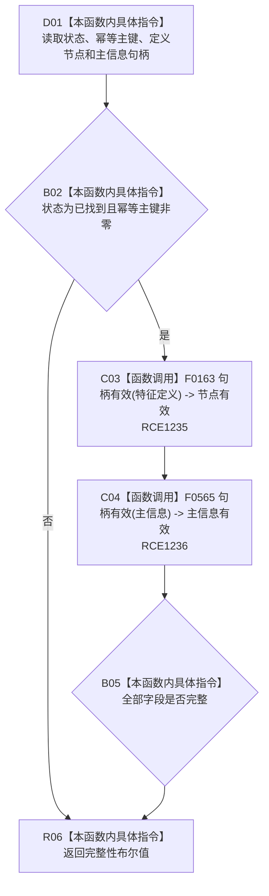

# CF-L9-0055 特征定义值式材料完整现状流程图

图类型：现状流程图
代码版本：`3920a74638264f9f539d50f32f3c9fe5fb1982ab`
源码 blob：`a47cd9b07794d30abc6cb9d1df319056105cd596`
覆盖文件：`海中鱼巣/领域/数据操作.特征体系.ixx:86-89`
唯一根函数：R0390
完整签名：`bool 海中鱼巣::特征定义值式材料::完整() const noexcept`
参数：无；隐式 `this` 为只读借用，不延长特征定义值式材料生命周期
返回结果：状态为已找到、幂等主键非零、定义节点句柄与主信息句柄均有效时返回 true，否则返回 false
调用图：`流程图/主程序可达调用关系/01_main可达项目调用边表.md`
逐行映射表：`流程图/代码流程图/L9/CF-L9-0055_特征定义值式材料完整_逐行代码映射表.md`
输入契约 / 调用语境表：调用方持有的值式特征定义材料
非成功返回二分审查表：false 保留状态与字段供调用方分类；上游保证完整后的 false 属于追根因对象
偏差清单：无新增聚合边差异
依据提交 / 结构化消息：聚合关系基线 `caab8644416dea13ea598b714289d1c86ac05304`；冻结源码提交 `3920a74638264f9f539d50f32f3c9fe5fb1982ab`
验证输出：本批 Mermaid、节点双向、源码覆盖与差异格式检查
不得作为施工许可：是
不得宣称：返回 true 表示特征定义满足任何调用方的业务用途

## 流程图

## 当前边界

- 本函数只检查值式材料字段，不重新读取节点仓库、主信息仓库、关系或索引。
- RCE1235、RCE1236 分别精确绑定节点句柄和主信息句柄重载。
