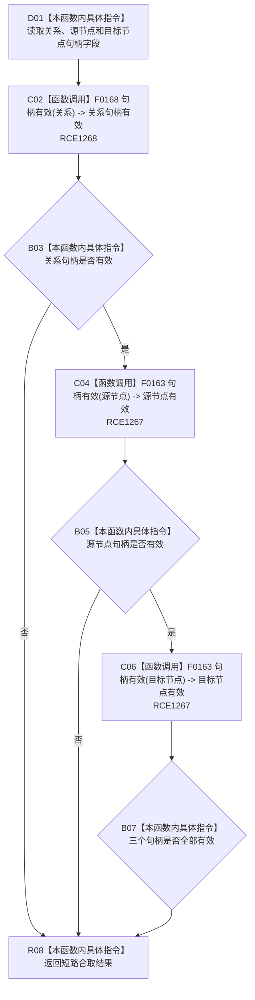

# CF-L9-0056 关系值式证据完整现状流程图

图类型：现状流程图
代码版本：`3920a74638264f9f539d50f32f3c9fe5fb1982ab`
源码 blob：`cc399ea69282bf3ae0b0d59c7f0b587e5164b187`
覆盖文件：`海中鱼巣/领域/数据操作.状态动态.ixx:59-61`
唯一根函数：R0404
完整签名：`bool 海中鱼巣::关系值式证据::完整() const noexcept`
参数：无；隐式 `this` 为只读借用，不延长关系值式证据生命周期
返回结果：关系句柄、源节点句柄和目标节点句柄全部有效时返回 true，否则返回 false
已登记调用方：R0407、R0665、R0667（RCE1283、RCE1970、RCE1976）
直接项目函数：F0168（RCE1268）、F0163（RCE1267）
外部边界：无
逐行映射表：`流程图/代码流程图/L9/CF-L9-0056_关系值式证据完整_逐行代码映射表.md`
结构读取与写入：只读值式证据中的三个句柄字段；不重新读取关系、节点或索引仓库
逻辑内返回：入口材料允许不完整时返回 false
内部错误边界：上游已保证完整关系证据后返回 false 时，由调用方作为关系证据缺失或漂移处理
依据提交 / 结构化消息：聚合关系基线 `caab8644416dea13ea598b714289d1c86ac05304`；冻结源码提交 `3920a74638264f9f539d50f32f3c9fe5fb1982ab`
验证输出：本批 Mermaid、节点双向、源码覆盖与差异格式检查
不得作为施工许可：是
不得宣称：返回 true 表示关系仍在仓库中有效、当前或满足领域基数

## 流程图

## 当前边界

- RCE1268 只对应第 60 行一次关系句柄检查；RCE1267 对应同一行源节点与目标节点两个节点句柄检查。
- 本函数不读取关系类型、顺序号、失效状态、端点类型或仓库当前性，只检查三个句柄的结构有效性。
