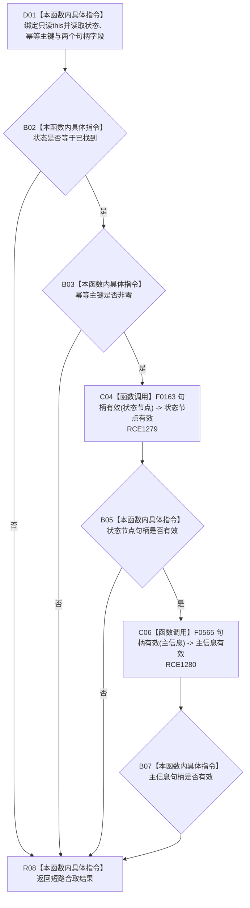

# CF-L9-0057 状态值式材料当前可读现状流程图

图类型：现状流程图
代码版本：`3920a74638264f9f539d50f32f3c9fe5fb1982ab`
源码 blob：`cc399ea69282bf3ae0b0d59c7f0b587e5164b187`
覆盖文件：`海中鱼巣/领域/数据操作.状态动态.ixx:90-93`
唯一根函数：R0406
完整签名：`bool 海中鱼巣::状态值式材料::当前可读() const noexcept`
参数：无显式参数；隐式 `this` 为只读借用，不延长状态值式材料生命周期
返回结果：状态为已找到、幂等主键非零且状态节点与主信息句柄均有效时返回 true，否则返回 false
已登记调用方：R0393、R0407（RCE2813、RCE1281）
直接项目函数：F0163（RCE1279）、F0565（RCE1280）
外部边界：无
逐行映射表：`流程图/代码流程图/L9/CF-L9-0057_状态值式材料当前可读_逐行代码映射表.md`
结构读取与写入：只读值式材料的读取状态、幂等主键、状态节点句柄和主信息句柄；不读取仓库，不改变机器结构
逻辑内返回：允许尚未找到或结构不完整的候选材料返回 false
内部错误边界：上游已经保证材料当前可读后仍返回 false 时，由调用方追查读取状态、幂等主键或句柄材料不一致
依据提交 / 结构化消息：当前维护基线 `7951b1bea78c7338643ab18428180d521e4d5a62`；冻结源码提交 `3920a74638264f9f539d50f32f3c9fe5fb1982ab`
验证输出：本批 Mermaid、节点双向、源码覆盖与差异格式检查
不得作为施工许可：是
不得宣称：返回 true 表示对应状态、主信息或幂等主键仍是仓库当前事实

## 流程图

## 当前边界

- RCE1279 与 RCE1280 是第 92 行两个不同句柄重载；前者接收 `状态节点`，后者接收 `主信息`。
- `&&` 按从左到右短路；任一前置条件为 false 时，后续句柄检查不会求值。
- 本函数只检查值式材料的结构可读条件，不回读节点、主信息、状态、关系或索引仓库。
