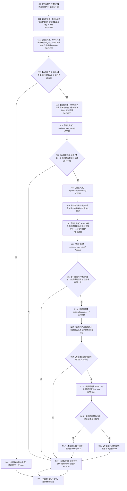

# CF-L9-0058 系统角色发布世界拓扑回调现状流程图

图类型：现状流程图
代码版本：`3920a74638264f9f539d50f32f3c9fe5fb1982ab`
源码 blob：`b24322d4588808299a232bc308bebd463b7a87a0`
覆盖文件：`海中鱼巣/领域/数据操作.系统角色.ixx:132-157`
唯一根函数：R0410
完整签名：`void 海中鱼巣::系统角色数据操作::发布世界拓扑(const 海中鱼巣::系统角色主体材料&) const::<lambda@数据操作.系统角色.ixx:132>::operator()(海中鱼巣::结构写入会话& 会话) const`
参数：`会话` 为 R0116 在当前事务内提供的可写借用；其余主体及四个状态标记均为外层 R0409 捕获引用
返回结果：`void`；通过捕获的冲突、不一致、结构变化和提交请求标记把结果传回 R0409
已登记调用方：R0116（RCE0561）
直接项目函数：R0415（RCE1286）、R0417（RCE1287）、R0418（RCE1288，两处）、R0041（RCE1289）
外部边界：X03828（`has_value`）、X03829（`operator->`）、X03830（析构）
逐行映射表：`流程图/代码流程图/L9/CF-L9-0058_系统角色发布世界拓扑回调_逐行代码映射表.md`
结构读取与写入：在一个结构写入会话内复核主体身份和场景接纳自我关系，确保世界根—场景与场景—自我两条普通父子关系；仅结构改变时请求提交
逻辑内返回：精确幂等无变化时不请求提交并返回外层
内部错误边界：身份或精确关系读回失败、来源关系不一致、挂载失败、关系读回失败或请求提交失败
依据提交 / 结构化消息：聚合关系基线 `7951b1bea78c7338643ab18428180d521e4d5a62`；冻结源码提交 `3920a74638264f9f539d50f32f3c9fe5fb1982ab`
验证输出：本批 Mermaid、节点双向、源码覆盖与差异格式检查
不得作为施工许可：是
不得宣称：回调返回 void 表示事务必然提交或普通读取路径已经可见

## 流程图

## 当前边界

- 两次 R0418 共用 RCE1288，以两个调用点分别冻结世界根—场景和场景—自我材料。
- `改变了结构` 为 false 是精确幂等路径；此时不调用 R0041，不把“未请求提交”写成失败。
- X03828、X03829、X03830 分别记录两个同类型 optional 局部结果的 `has_value`、`operator->` 和逆序析构。
