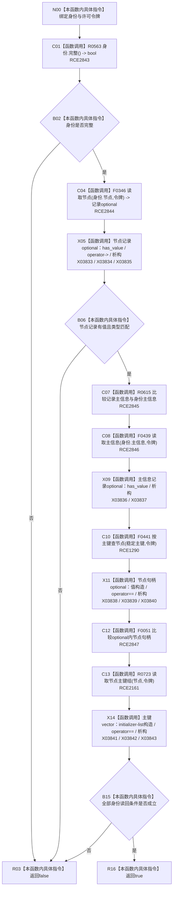

# CF-L9-0059 系统角色复核身份已许可现状流程图

图类型：现状流程图
代码版本：`3920a74638264f9f539d50f32f3c9fe5fb1982ab`
源码 blob：`b24322d4588808299a232bc308bebd463b7a87a0`
覆盖文件：`海中鱼巣/领域/数据操作.系统角色.ixx:229-241`
唯一根函数：R0413
完整签名：`bool 海中鱼巣::系统角色数据操作::复核身份_已许可(const 海中鱼巣::系统角色身份材料& 身份, const 海中鱼巣::结构事务令牌& 令牌) const`
参数：`身份` 与 `令牌` 均为只读借用，调用方保证令牌许可生命周期覆盖调用
返回结果：身份完整，节点记录类型/主信息匹配，主信息可读，稳定主键唯一绑定该节点且节点主键组精确单项匹配时返回 true，否则 false
已登记调用方：R0421（RCE1309）
直接项目函数：R0563（RCE2843）、F0346（RCE2844）、R0615（RCE2845）、F0439（RCE2846）、F0441（RCE1290）、F0051（RCE2847）、R0723（RCE2161）
外部边界：X03833—X03843
逐行映射表：`流程图/代码流程图/L9/CF-L9-0059_系统角色复核身份已许可_逐行代码映射表.md`
结构读取与写入：只读节点、主信息与索引；不写机器结构
逻辑内返回：调用语境以当前清单复核为前提，false 由上层映射为版本漂移
内部错误边界：无单独错误通道；任一不匹配压为 false
依据提交 / 结构化消息：聚合关系基线 `7951b1bea78c7338643ab18428180d521e4d5a62`；冻结源码提交 `3920a74638264f9f539d50f32f3c9fe5fb1982ab`
验证输出：本批 Mermaid、节点双向、源码覆盖与差异格式检查
不得作为施工许可：是
不得宣称：返回 true 表示身份相关的其它业务关系或领域记录完整

## 流程图

## 当前边界

- RCE1290 的真实调用点是第 237 行索引仓库带令牌重载；第 233 行节点仓库读取由新增 RCE2844 → F0346 承载。
- optional 节点句柄的值构造、容器相等与析构分别由 X03838—X03840 承载，元素相等回调独立记为 RCE2847 → F0051。
- 节点记录主信息句柄比较独立记为 RCE2845 → R0615，不并入 optional 或内建比较。
