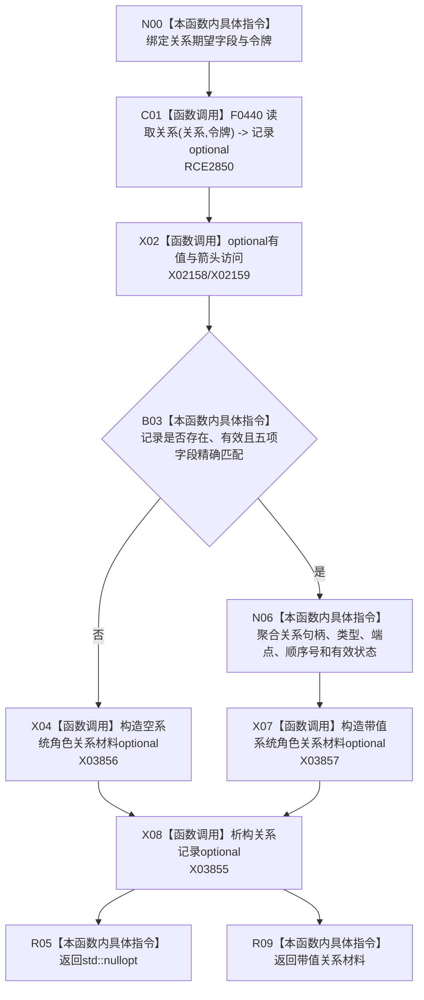

# CF-L9-0060 系统角色形成关系材料已许可现状流程图

图类型：现状流程图
代码版本：`3920a74638264f9f539d50f32f3c9fe5fb1982ab`
源码 blob：`b24322d4588808299a232bc308bebd463b7a87a0`
覆盖文件：`海中鱼巣/领域/数据操作.系统角色.ixx:264-279`
唯一根函数：R0416
完整签名：`std::optional<海中鱼巣::系统角色关系材料> 海中鱼巣::系统角色数据操作::形成关系材料_已许可(海中鱼巣::关系句柄 关系, 海中鱼巣::关系类型 类型, 海中鱼巣::节点句柄 源节点, 海中鱼巣::节点句柄 目标节点, std::int64_t 顺序号, const 海中鱼巣::结构事务令牌& 令牌) const`
参数：关系句柄、类型、源节点、目标节点和顺序号按值传入；`令牌` 为只读许可借用
返回结果：关系记录存在、有效且全部字段精确匹配时返回系统角色关系材料；否则 `std::nullopt`
已登记调用方：R0419（RCE1305）、R0421（RCE1311）
直接项目函数：F0440（RCE2850）
外部边界：X02158、X02159、X03855—X03857
逐行映射表：`流程图/代码流程图/L9/CF-L9-0060_系统角色形成关系材料已许可_逐行代码映射表.md`
结构读取与写入：带令牌只读关系仓库，不写结构
逻辑内返回：关系缺失或任一精确字段不匹配返回空 optional
内部错误边界：调用方根据语境将空结果映射为版本漂移或结构不一致
依据提交 / 结构化消息：聚合关系基线 `7951b1bea78c7338643ab18428180d521e4d5a62`；冻结源码提交 `3920a74638264f9f539d50f32f3c9fe5fb1982ab`
验证输出：本批 Mermaid、节点双向、源码覆盖与差异格式检查
不得作为施工许可：是
不得宣称：返回材料表示该关系之外的来源唯一性或业务拓扑完整

## 流程图

## 当前边界

- 现有 X02158/X02159 分别承载 `has_value` 与五次 `operator->`；X03855 补齐关系记录 optional 的 RAII 析构，X03856/X03857 分账空构造和值构造。
- F0440 是关系仓库带令牌重载，新增 RCE2850 固定第 271 行真实调用。
