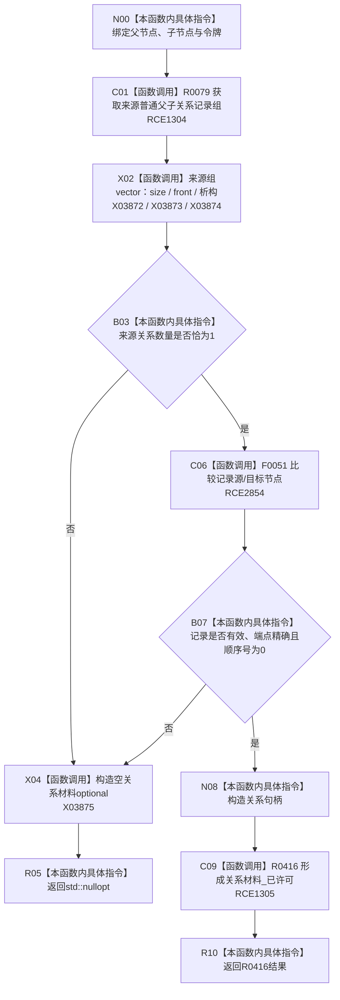

# CF-L9-0061 系统角色读取唯一父关系已许可现状流程图

图类型：现状流程图
代码版本：`3920a74638264f9f539d50f32f3c9fe5fb1982ab`
源码 blob：`b24322d4588808299a232bc308bebd463b7a87a0`
覆盖文件：`海中鱼巣/领域/数据操作.系统角色.ixx:338-353`
唯一根函数：R0419
完整签名：`std::optional<海中鱼巣::系统角色关系材料> 海中鱼巣::系统角色数据操作::读取唯一父关系_已许可(海中鱼巣::节点句柄 父节点, 海中鱼巣::节点句柄 子节点, const 海中鱼巣::结构事务令牌& 令牌) const`
参数：父/子节点按值传入；`令牌` 为只读许可借用
返回结果：来源普通父子关系恰一条且字段精确，并经 R0416 完整读回时返回材料；否则空 optional
已登记调用方：R0421（RCE1312，两处）
直接项目函数：R0079（RCE1304）、F0051（RCE2854，两处）、R0416（RCE1305）
外部边界：X03872—X03875
逐行映射表：`流程图/代码流程图/L9/CF-L9-0061_系统角色读取唯一父关系已许可_逐行代码映射表.md`
结构读取与写入：带令牌只读来源关系组，再委托 R0416 读回关系记录
逻辑内返回：关系数量不是一或字段不精确返回空
内部错误边界：上层完整清单读回把空结果映射为版本漂移
依据提交 / 结构化消息：聚合关系基线 `7951b1bea78c7338643ab18428180d521e4d5a62`；冻结源码提交 `3920a74638264f9f539d50f32f3c9fe5fb1982ab`
验证输出：本批 Mermaid、节点双向、源码覆盖与差异格式检查
不得作为施工许可：是
不得宣称：返回关系材料表示其它父子关系或归属关系完整

## 流程图

## 当前边界

- RCE2854 聚合第 346、347 行两个节点句柄相等调用。
- R0419 自身只做数量和首项字段筛选；关系句柄版本及记录完整性最终由 R0416 复核。
