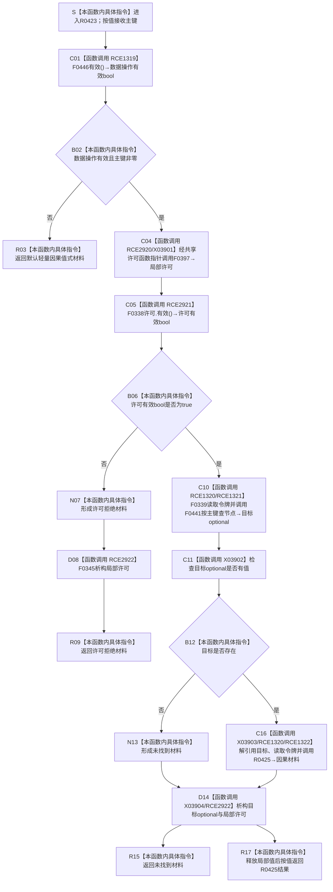

# CF-L9-0062 读取主键因果引用现状流程图

图类型：现状流程图
代码版本：`3920a74638264f9f539d50f32f3c9fe5fb1982ab`
当前工作区复核基线：`7951b1bea78c7338643ab18428180d521e4d5a62`
源码 blob：`fdc9a1b062b28feffec733dd1a0e342812ef1ddc`
覆盖文件：`海中鱼巣/领域/数据操作.轻量因果.ixx:125-132`
唯一根函数：R0423
完整签名：`海中鱼巣::轻量因果值式材料 海中鱼巣::轻量因果数据操作::读取主键因果引用(std::uint64_t 主键) const`
参数：隐式 `this` 为调用期有效的 const `轻量因果数据操作` 非拥有借用；`主键` 按值传入，`0` 在入口被拒绝
返回结果：入口无效或主键为零时返回默认 `轻量因果值式材料`；许可无效时返回 `许可拒绝`；索引未命中时返回 `未找到`；其余情况把目标、主键和许可令牌交给 R0425 并按值返回其读取材料
调用方：R0512 经 RCE1514；R0689 经 RCE2041
直接项目函数：RCE1319、RCE1320—RCE1322、RCE2920—RCE2922
符号外部边界：X03901—X03904
调用图：`流程图/主程序可达调用关系/01_main可达项目调用边表.md`
外部边界表：`流程图/主程序可达调用关系/02_main可达外部边界表.md`
逐行映射表：`流程图/代码流程图/L9/CF-L9-0062_读取主键因果引用_逐行代码映射表.md`
输入契约 / 调用语境表：本文“读取语境与非成功分账”
非成功返回二分审查表：本文“读取语境与非成功分账”
偏差清单：本文“当前边界与规范核对”
依据提交 / 结构化消息：冻结源码提交 `3920a74638264f9f539d50f32f3c9fe5fb1982ab`；在当前 `main` 基线 `7951b1bea78c7338643ab18428180d521e4d5a62` 复核目标源码零差异
验证输出：8 行源码完整映射；7 个项目出边、4 个外部边界、0 个未解析项目调用；本切片不运行构建或程序
依据：`规范/0050_项目通用机器逻辑与禁止性规则总纲_20260721.md`、`规范/0600_代码函数流程图应用与维护规范.md`、`规范/1190_根规范_因果_20260720.md`、`规范/4010_子规范_统一仓库稳定句柄与通用关系索引边界.md`、`规范/4040_子规范_不透明结构事务候选确认撤销与最后发布.md`、`规范/4050_子规范_入口拒绝逻辑内结果与内部逻辑错误.md`
不得作为施工许可：是
不得宣称：轻量因果引用等于完整稳定因果事实、空返回唯一证明目标不存在、许可取得或只读结果形成了新的机器事实，或本函数证明完整因果能力已经闭环

## 流程图

## 项目源码调用合同

| 调用边 | 节点 | 被调函数 | 实参与结果 |
| --- | --- | --- | --- |
| RCE1319 | C01 | F0446 `轻量因果数据操作::有效() const noexcept` | 当前 `this`；返回 bool 参与入口合取 |
| RCE2920 / X03901 | C04 | F0397 共享许可函数对象调用 | `接线_.运行期状态`；形成局部 `结构事务许可` |
| RCE2921 | C05 | F0338 `结构事务许可::有效() const` | `this=&许可`；返回 bool 决定许可拒绝或继续 |
| RCE1320 | C10 / C16 | F0339 `结构事务许可::读取令牌() const` | `this=&许可`；令牌引用立即传给 F0441 或 R0425 |
| RCE1321 | C10 | F0441 `索引仓库::按主键查节点(...) const` | `主键` 与许可令牌；返回目标 optional |
| RCE1322 | C16 | R0425 `读取因果引用_已许可(...) const` | 解引用目标、`主键`、许可令牌；结果按值返回 |
| RCE2922 | D08 / D14 | F0345 `结构事务许可::~结构事务许可() noexcept` | 正常返回或异常展开时释放已形成许可 |

## 外部边界

| 边界 | 调用点 | 静态调用 |
| --- | --- | --- |
| X03901 | 127 | `海中鱼巣::结构事务许可 (*)(const std::shared_ptr<void>&)` 原始函数指针调用 |
| X03902 | 130 | `bool std::optional<海中鱼巣::节点句柄>::has_value() const noexcept` |
| X03903 | 131 | `const 海中鱼巣::节点句柄& std::optional<海中鱼巣::节点句柄>::operator*() const& noexcept` |
| X03904 | 129-132 | `std::optional<海中鱼巣::节点句柄>::~optional()` |

## 读取语境与非成功分账

| 节点 | 当前条件 | 结果 | 二分口径 | 结构变化 |
| --- | --- | --- | --- | --- |
| B02 / R03 | 数据操作无效或主键为零 | 默认材料 | 入口拒绝 | 无 |
| B06 / R09 | 共享许可已形成但无效 | `许可拒绝` | 逻辑内返回 | 无；许可释放 |
| B12 / R15 | 有效许可下按主键未找到目标 | `未找到` | 逻辑内返回；强前置保证索引必命中时转为待核内部差异 | 无；optional 与许可释放 |
| C16 / R17 | 目标存在 | 传播 R0425 读取材料 | 由 R0425 裁决 | 本函数无写入 |

## 当前边界与规范核对

- R0423 只读取轻量因果引用身份入口；1190 明确该入口不等于完整或稳定因果结论。
- RCE1319 的当前源码调用点只有 126 行；128 行的 `许可.有效()` 由 RCE2921 指向 F0338。
- 127 行共享许可形成同时登记唯一项目目标 RCE2920/F0397 与调用形态 X03901；局部许可在所有构造完成后的返回 / 异常路径经 RCE2922 释放。
- 本图登记当前代码事实，不修改共享关系表，也不把新边写成已发布聚合事实。
