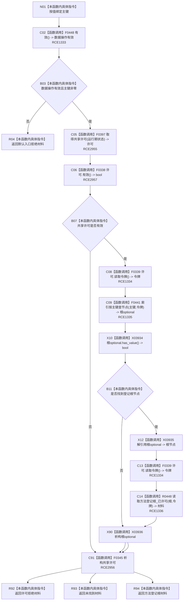

# CF-L9-0063 需求任务方法读取主键方法登记根现状流程图

图类型：现状流程图
代码版本：`3920a74638264f9f539d50f32f3c9fe5fb1982ab`
源码 blob：`16ac9534baeda26ac8a712066e713f3339f6e0c8`
覆盖文件：`海中鱼巣/领域/数据操作.需求任务方法.ixx:1159-1166`
唯一根函数：R0430
完整签名：`方法登记根材料 海中鱼巣::需求任务方法数据操作::读取主键方法登记根(std::uint64_t 主键) const`
参数：`主键` 按值传入；零值非法
返回结果：入口无效返回默认材料；许可拒绝或未找到返回具名状态；找到节点后返回已许可读取结果
已登记调用方：R0432、R0497（RCE1338、RCE1501）
直接项目函数：F0448（RCE1333）、F0397（RCE2955）、F0338（RCE2957）、F0339（RCE1334）、F0441（RCE1335）、R0448（RCE1336）、F0345（RCE2956）
外部边界：X03934—X03936
逐行映射表：`流程图/代码流程图/L9/CF-L9-0063_需求任务方法读取主键方法登记根_逐行代码映射表.md`
结构读取与写入：只读索引和方法登记根材料；不写机器结构
逻辑内返回：入口拒绝、许可拒绝和主键未找到
内部错误边界：由 R0448 负责已许可结构读取异常分类
依据提交 / 结构化消息：当前维护基线 `7951b1bea78c7338643ab18428180d521e4d5a62`；冻结源码提交 `3920a74638264f9f539d50f32f3c9fe5fb1982ab`
不得作为施工许可：是
不得宣称：返回已找到表示登记根的业务语义已经验收

## 流程图

## 当前边界

- 本函数与 R0429 使用相同共享许可—索引定位—已许可读取结构，但返回材料类型不同。
- X03934—X03936 分别记录根节点 optional 的存在检查、解引用和生命周期。
- 原 RCE1333 同时挂载第 1160 行 `有效()` 与第 1162 行 `许可.有效()`，端点只能对应 F0448；许可有效调用必须独立登记为 RCE2957。
